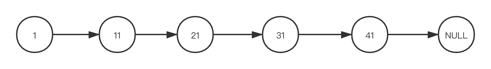
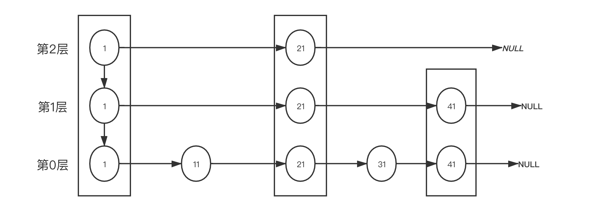
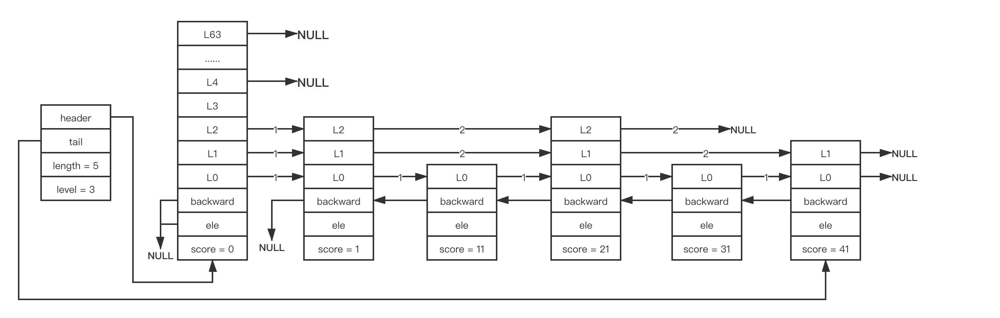
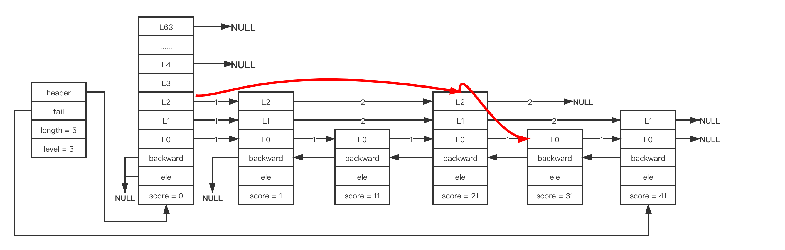
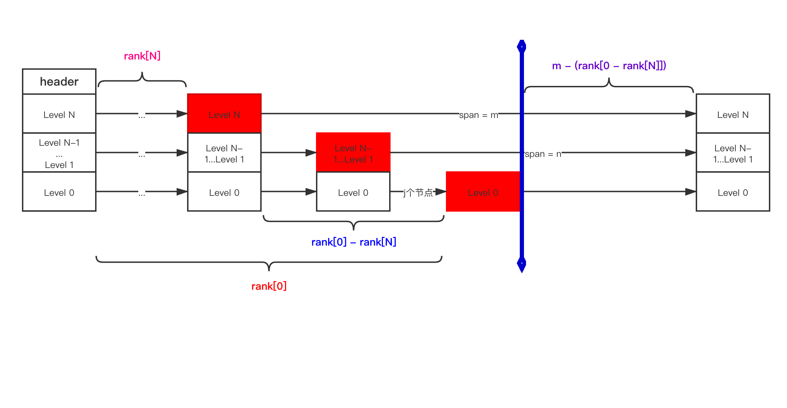

# 跳跃表


### 1. 作用

> 有序集合底层实现；
>
> 采用跳跃表的原因: 
>
> 1. 数组不便于元素的插入和删除;
> 2. 链表查询效率低;
> 3. 平衡树或红黑树等结构效率高但实现复杂;
>
> 跳跃表效率堪比红黑树, 但实现比红黑树简单；

### 2. 设计思想

#### 2.1 有序链表

  

> 如上图所示： 一般有序链表查询时间复杂度为 O(N)，而修改操作基本不消耗时间；


#### 2.2 跳跃表



在跳表中查找值为31的节点，步骤如下:

1. 从第2层开始，1比31小，向后比较；
2. 21小于31，继续向后比较；21节点的next指针为NULL，所以从21节点开始下降一层到第1层开始查找;
3. 第1层中，21节点的next节点为41；由于41比31大，所以从21节点再往下降一层；
4. 第0层中，21节点的next为31，查找到正确的节点；

>  ***总结跳跃表的基本思想为：***
>
> **通过将有序集合的部分节点分层，由最上层开始依次向后查找，如果本层的next节点大于要查找的值或next节点为NULL，则从本节点开始，降低一层继续向后查找；依次类推，如果找到则返回节点；否则返回NULL；**
>
> **采用本原理查找节点，在节点数量比较多时，可以跳过一些节点，查询效率大大提升；**
>
> **跳跃表的本质是以牺牲空间的形式来达到快速查找的目的；**


### 3. 实现

#### 3.1 性质



从上图中可以看到跳跃表有如下性质：

1. 由很多层组成；
2. 有一个表头（header）节点，头节点中有一个64层的结构，每层的结构包含指向本层的下个节点的指针，**指向本层下个节点中间所跨越的节点个数为本层的跨度（span）；**
3. 除头节点外，层数最多的节点的层高为跳跃表的高度（level），上图中跳跃表的高度为3；
4. 每层都是一个有序链表，数据递增；
5. 除header节点外，一个元素在上层有序链表中出现，则它一定会在下层有序链表中出现；
6. 跳跃表每层最后一个节点指向NULL，表示本层有序链表的结束；
7. 跳跃表有一个tail指针，指向跳跃表最后一个节点；
8. 最底层的有序链表包含所有节点， 最底层的节点个数为跳跃表的长度(length)(不包含头节点)，上图跳表长度为7
9. 每个节点包含一个后退指针(backward)，头节点和第一个节点指向NULL；其它节点指向最底层的前一个节点；


#### 3.2 定义

##### 3.2.1 跳跃表节点 zskiplistNode

```C
//server.h

/* ZSETs use a specialized version of Skiplists */
typedef struct zskiplistNode {
    sds ele;
    double score;
    struct zskiplistNode *backward; //指向最底层的前一个节点, 在高层中没有后退指针;
  
    // 下面是一个柔性数组, 定义了每个节点包含的每层数据;
    // 每个节点可能是不同的层数, 所以节点之间level数组长度也不一样;
    struct zskiplistLevel {
        struct zskiplistNode *forward; //每层指向的下一个节点
        unsigned long span; //forward指向的节点与本节点之间的元素个数. span值越大，跳过的节点数越多;
    } level[];
} zskiplistNode;
```

##### 3.2.2 跳跃表

```C
//server.h
typedef struct zskiplist {
    /*
    tail指向第一层的最后一个节点, 可能会发生变化;
    而header指向的是一个创建的特殊节点, 而这个特殊节点中的level数组长度一定是64, 且每层forward初始化为NULL
    */
    struct zskiplistNode *header, *tail;
    unsigned long length; //跳跃表长度
    int level; //跳跃表高度
} zskiplist;
```


#### 3.3 相关操作实现

##### 3.3.1 创建节点

###### 3.3.1.1 确定新节点的层高

> **节点层高的最小值是 1，最大值是 ZSKIPLIST_MAXLEVEL （即64）;**
>
> **Redis通过 zslRandlomLevel 函数随机生成一个 1～64 的值，来做为新节点的层高；值越大出现的概率越低;**

```C
// server.h
#define ZSKIPLIST_MAXLEVEL 64
#define ZSKIPLIST_P 0.25

// t_zset.c
/*
根据while循环逻辑, 每次生成一个随机值，取这个值的低16位做为x,当x小于(0.25*0xFFFF)时, level值增加1; 
因为level初始值为1, 假设 p=ZSKIPLIST_P;
则层高为1的概率为(1-p); 层高为2的概率为p(1-p);层高为n的概率为 (p的n-1次方)*(1-p); 计算期望值为 1/(1-p);
当 p=0.25时, 跳跃表节点的期望层高为 1/(1-0.25), 约为 1.33
*/
int zslRandomLevel(void) {
    int level = 1;
    while ((random()&0xFFFF) < (ZSKIPLIST_P * 0xFFFF))
        level += 1;
    return (level<ZSKIPLIST_MAXLEVEL) ? level : ZSKIPLIST_MAXLEVEL;
}
```

###### 3.3.1.2 创建新节点

```C
// t_zset.c

/* Create a skiplist node with the specified number of levels.
 * The SDS string 'ele' is referenced by the node after the call. */
/*
参数: level为层高, 随机生成; 
score为value, ele为key, 均为用户传入
*/
zskiplistNode *zslCreateNode(int level, double score, sds ele) {
    zskiplistNode *zn =
        zmalloc(sizeof(*zn)+level*sizeof(struct zskiplistLevel));
    zn->score = score;
    zn->ele = ele;
    return zn;
}
```

##### 3.3.2 创建跳跃表

```C
//t_zset.c

/* Create a new skiplist. */
zskiplist *zslCreate(void) {
    int j;
    zskiplist *zsl;

    zsl = zmalloc(sizeof(*zsl)); //分配内存
    zsl->level = 1; //跳跃表层高默认为1
    zsl->length = 0;
    
    // 关于头节点, 它的层高不是随机生成的, 而是固定大小64
    // 调用上面说明的zslCreateNode
    zsl->header = zslCreateNode(ZSKIPLIST_MAXLEVEL,0,NULL);
  
    // 初始化头节点的值为NULL和0
    for (j = 0; j < ZSKIPLIST_MAXLEVEL; j++) {
        zsl->header->level[j].forward = NULL;
        zsl->header->level[j].span = 0;
    }
    zsl->header->backward = NULL; //跳跃表其它字段也初始化为默认空值
    zsl->tail = NULL;
    return zsl;
}
```


##### 3.3.3 插入节点

```C
/*
插入节点的步骤:
1. 查找要插入的位置 
2. 调整跳跃表高度
3. 插入节点
4. 调整backward
*/
zskiplistNode *zslInsert(zskiplist *zsl, double score, sds ele) {
    zskiplistNode *update[ZSKIPLIST_MAXLEVEL], *x;
    unsigned int rank[ZSKIPLIST_MAXLEVEL];
    int i, level;

    serverAssert(!isnan(score));
  
    /*
    第1步: 查找要插入的位置;
    update[]数组: 插入节点时, 需要更新被插入节点每层的前一个节点。由于每层更新的节点不一样, 所以每层需要更新的节点记录在 update[i]中; 
    rank[]数组: 记录当前层从header节点到update[i]节点所经历的步长, 在更新update[i]的span和设置新插入节点的span值时用到;
    
    根据 3.1节 关于跳跃表的性质5,一个节点在上层的链表中出现, 那么它一定在下层链表中出现;
    所以这里从跳跃表的最高层开始到第1层遍历;
    */
    x = zsl->header;
    for (i = zsl->level-1; i >= 0; i--) {
        /* store rank that is crossed to reach the insert position */
        rank[i] = i == (zsl->level-1) ? 0 : rank[i+1];
        while (x->level[i].forward &&
                (x->level[i].forward->score < score ||
                    (x->level[i].forward->score == score &&
                    sdscmp(x->level[i].forward->ele,ele) < 0)))
        {
            rank[i] += x->level[i].span;
            x = x->level[i].forward;
        }
        update[i] = x;
    }
  
    /* we assume the element is not already inside, since we allow duplicated
     * scores, reinserting the same element should never happen since the
     * caller of zslInsert() should test in the hash table if the element is
     * already inside or not. */
    /*
    第2步: 调整跳跃表高度; 
    由于新插入节点的高度是随机生成的, 如果生成的高度小于跳跃表现有高度, 则不需要修改跳跃表高度; 
    但如果新节点的高度大小现有高度: 则需要 1. 修改跳跃表高度值;  2. 更新每层需要节点数级 update[] 和 rank[]
    
    对于高度大于跳跃表高度的节点, 则对于高出原 zsl.level的部分, 只需要更新 header.level[];
    */
    level = zslRandomLevel();
    if (level > zsl->level) {
        for (i = zsl->level; i < level; i++) {
            rank[i] = 0;
            update[i] = zsl->header;
            update[i]->level[i].span = zsl->length;
        }
        zsl->level = level;
    }
  
    /*
    第3步: 插入节点; 除了更新各层forward指针, 还要另外计算与更新对应的span值;
    */
    x = zslCreateNode(level,score,ele);
    for (i = 0; i < level; i++) {
        x->level[i].forward = update[i]->level[i].forward;
        update[i]->level[i].forward = x;

        /* update span covered by update[i] as x is inserted here */
        x->level[i].span = update[i]->level[i].span - (rank[0] - rank[i]);
        update[i]->level[i].span = (rank[0] - rank[i]) + 1;
    }

    /* increment span for untouched levels */
    // 第3.1步: 更新未触及到的层高节点的span值增加1
    for (i = level; i < zsl->level; i++) {
        update[i]->level[i].span++;
    }

    /*
    第4步: 更新backward指针
    */
    x->backward = (update[0] == zsl->header) ? NULL : update[0];
    if (x->level[0].forward)
        x->level[0].forward->backward = x;
    else
        zsl->tail = x;
    zsl->length++;
    return x;
}
```


###### 3.3.3.1 查找要插入的位置



+ 从zskiplist zsl中保存的最高层开始(上面level值为3, 以对应header.level[2]开始)，按红线确定最高层的要插入节点的位置（上面是 score=21 节点）后；
+ 从该节点开始向下走, 找到下面一层的要插入节点（这里L1 处的节点也是 score=21处）;
+ 按上面的方式继续向下查找，直到 L0层, 这样**红线所经过的每层的最后一个节点，就是每层需要更新的节点;**


###### 3.3.3.2 调整跳跃表高度

> **本操作只能在新节点的level值大于跳跃表自身高度 zsl.level值时才会执行；**

> 这里做了两步操作：
>
> 1. **更新跳跃表高度，即修改 zsl->level 值为新节点的高度level值：**
> 2. **由于 3.3.3.1 中查找要更新的节点时，只获取到了原跳跃表高度的对应 rank[0]~rank[原level] 以及 update[0]~update[原level] 数组； 现在由于新节点高度以及跳跃表高度发生了变化，所以也要填充**
>    **rank[原level+1]~rank[新level]  和 update[原level+1]~update[新level] 的值；根据rank[]数组 和 update[]数组的意义， 可以知道需要填充的 update[]值即为 header；而rank[]填充0； 此外，还需要修改 对应level的span为length;**


###### 3.3.3.3 插入节点

> ```C
> x = zslCreateNode(level,score,ele);
>  
> for (i = 0; i < level; i++) {
>   //1. 对于每层需要更新节点, 更新当层的forward指针, 实现比较简单
>   x->level[i].forward = update[i]->level[i].forward;    
>   update[i]->level[i].forward = x;
> 
>        
>   /* update span covered by update[i] as x is inserted here */
>   //2. 关于每层的span更新, 具体见下面的说明;  
>   x->level[i].span = update[i]->level[i].span - (rank[0] - rank[i]);
>   update[i]->level[i].span = (rank[0] - rank[i]) + 1;
>    
> }
>  
> /* increment span for untouched levels */
> // 对于未触及的level, 直接更新span值, 将其增1
> for (i = level; i < zsl->level; i++) {
>   update[i]->level[i].span++;
> }
> ```

+ 关于 rank[0]、rank[N]、update[i]->level[i].span 之间的关系如下图:

  

+ 根据上图关系, 如果新添加一个节点到 竖蓝线 处，那么对于 Level N层的 update[N].level[N].span的值应该修改为:  **(rank[0] - rank[i] + 1);  +1表示新添加的节点**； 而新添加节点的Level N层的span值为: **update[N]->level[N].span- (rank[0] - rank[N])**

+ 如果新节点的level高度比跳跃表的高度小, 则对于高出新节点的update[N]处, 不需要修改 forward值, **但需要将span值自增1；**


###### 3.3.3.4 更新backward指针以及增加length

> **对于新增加的节点，需要做前一节点是否是header 以及自己是否是tail的判断；**


##### 3.3.4 删除节点

```C
// t_zset.c
/* Delete an element with matching score/element from the skiplist.
 * The function returns 1 if the node was found and deleted, otherwise
 * 0 is returned.
 *
 * If 'node' is NULL the deleted node is freed by zslFreeNode(), otherwise
 * it is not freed (but just unlinked) and *node is set to the node pointer,
 * so that it is possible for the caller to reuse the node (including the
 * referenced SDS string at node->ele). */

/*
删除节点步骤: 1. 查找要更新的节点; 2.设置span和forward
*/
int zslDelete(zskiplist *zsl, double score, sds ele, zskiplistNode **node) {
    zskiplistNode *update[ZSKIPLIST_MAXLEVEL], *x;
    int i;

    //1. 查找要更新的节点, 方法与插入节点时查找要更新的节点的方法相似, 只是这里不需要计算rank值;
    x = zsl->header;
    for (i = zsl->level-1; i >= 0; i--) {
        while (x->level[i].forward &&
                (x->level[i].forward->score < score ||
                    (x->level[i].forward->score == score &&
                     sdscmp(x->level[i].forward->ele,ele) < 0)))
        {
            x = x->level[i].forward;
        }
        update[i] = x;
    }
    
  
    /* We may have multiple elements with the same score, what we need
     * is to find the element with both the right score and object. */
    //2. 更新span和forward值; 这里是先计算完了各层需要更新的节点后才 check是否包含要删除的结点;
    x = x->level[0].forward;
    if (x && score == x->score && sdscmp(x->ele,ele) == 0) {
        zslDeleteNode(zsl, x, update);
        if (!node)
            zslFreeNode(x);
        else
            *node = x;
        return 1;
    }
    return 0; /* not found */
}

/* Internal function used by zslDelete, zslDeleteByScore and zslDeleteByRank */
/*
update参数即为各层需要更新的节点数组;
*/
void zslDeleteNode(zskiplist *zsl, zskiplistNode *x, zskiplistNode **update) {
    int i;
    for (i = 0; i < zsl->level; i++) {
        if (update[i]->level[i].forward == x) {
            //对于forward指针指向x, 则更新此节点的span值和forward值
            update[i]->level[i].span += x->level[i].span - 1;
            update[i]->level[i].forward = x->level[i].forward;
        } else {
            //forward指针不指向X情况是: 跳跃表的高度大于要删除节点的高度, 从而在第N层之上的链表中不存在x
            //此时只需要将span值减1即可
            update[i]->level[i].span -= 1;
        }
    }
  
    //更新backward指针;
    if (x->level[0].forward) {
        x->level[0].forward->backward = x->backward;
    } else {
        zsl->tail = x->backward;
    }
  
    //更新高度（即如果被删除的节点是跳跃表中高度最高的节点, 则删除节点后更新整个跳跃表的高度）
    while(zsl->level > 1 && zsl->header->level[zsl->level-1].forward == NULL)
        zsl->level--;
    //更新length;
    zsl->length--;
}
```


### 4. 跳跃表的应用

> **在Redis中，跳跃表主要应用于有序集合的底层实现（在序集合的另一种实现方式为压缩列表）；**
>
> Redis 的配置文件中关于有序集合底层实现的两个配置：
>
> 1. zset-max-ziplist-entries 128: zset采用压缩列表时，元素个数最大值。默认为128；
> 2. zset-max-ziplist-value 64: zset采用压缩列表时，每个元素的字符串长度最大值。默认64；
>
> zset添加元素的主要逻辑位于 t_zset.c 的 zaddGenericCommand 函数中。 zset插入第一个元素时，会判断下面两种条件：
>
> 1. zset-max-ziplist-entries 的值是否等于0； 若不等于0，当前zset中元素个数大于zset-max-ziplist_entries配置；
> 2. zset-max-ziplist-value 小于要插入元素的字符串长度；
>
> 满足任一条件 Redis就会采用跳跃表作为底层实现，否则采用压缩列表作为底层实现；