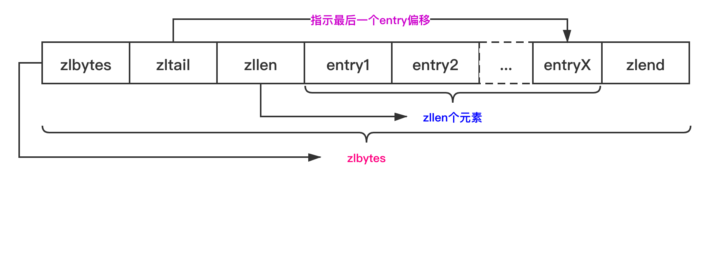
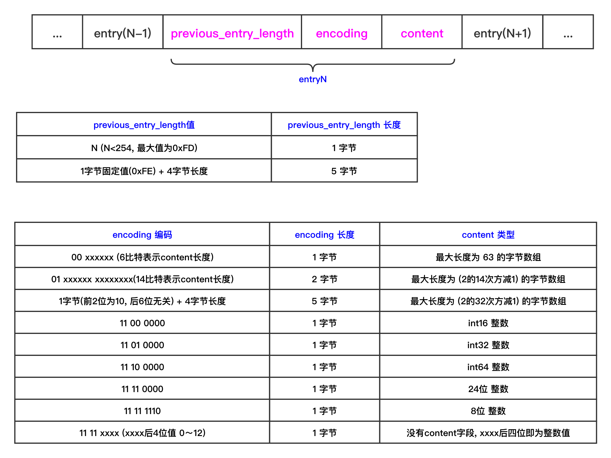
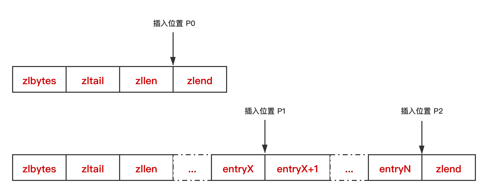
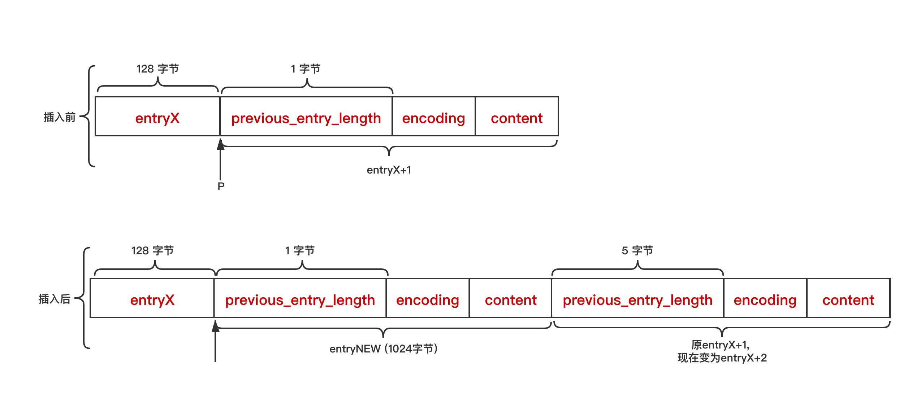

# 压缩列表 ziplist


### 1. 概念

> 压缩列表 ziplist 本质上是一个字节数组，是Redis为了节约内存而设计的一种线性数据结构，可以包含多个元素，每个元素可以是一个字节数组或一个整数；

> **Redis的有序集合、散列、列表都直接或间接使用了压缩列表。当有序集合或散列表的元素个数比较少，且元素都是短字符串时，Redis便使用压缩列表作为其底层数据存储结构。列表使用快速链表（quicklist）数据结构存储，而快速链表就是双向链表与压缩列表的组合；**


### 2. 存储结构



+ 1. zlbytes: 压缩列表的字节长度，4字节，因此压缩列表最多有 (2的32次方 - 1) 个字节；
  2. zltail: 压缩列表尾元素相对于压缩列表起始地址的偏移量，4字节；
  3. zllen: 压缩列表元素个数，2字节。
  4. entryX: 压缩列表存储的特定元素，可以是字节数组或者整数，长度不限。entry也有它的编码结构；
  5. zlend: 结尾标志，1字节，恒为 0xFF.

  

#### 2.1 常用宏

```C
/*
假设 char *zl 指向压缩列表首地址，Redis可通过以下宏定义实现压缩列表各个字段的存取操作
*/
// ziplist.c
/* Return total bytes a ziplist is composed of. */
#define ZIPLIST_BYTES(zl)       (*((uint32_t*)(zl)))

/* Return the offset of the last item inside the ziplist. */
#define ZIPLIST_TAIL_OFFSET(zl) (*((uint32_t*)((zl)+sizeof(uint32_t))))

/* Return the length of a ziplist, or UINT16_MAX if the length cannot be
 * determined without scanning the whole ziplist. */
#define ZIPLIST_LENGTH(zl)      (*((uint16_t*)((zl)+sizeof(uint32_t)*2)))

/* Return the pointer to the last byte of a ziplist, which is, the
 * end of ziplist FF entry. */
#define ZIPLIST_ENTRY_END(zl)   ((zl)+intrev32ifbe(ZIPLIST_BYTES(zl))-1)
```


#### 2.2 压缩列表元素编码结构



+ 上图中的最后一行, **1111xxxx**中的'xxxx'值范围是**0~12**, 但根据下面关于函数**zipIntSize**的说明, 它的范围其实应该是**0~13;** **所以这里做一个更改；**

+ 根据上面对encoding的说明，Redis预定义了以下常量对应encoding字段的各编码类型:

  ```C
  //ziplist.c
  #define ZIP_STR_MASK 0xc0
  #define ZIP_INT_MASK 0x30
  
  #define ZIP_STR_06B (0 << 6)
  #define ZIP_STR_14B (1 << 6)
  #define ZIP_STR_32B (2 << 6)
  #define ZIP_INT_16B (0xc0 | 0<<4)
  #define ZIP_INT_32B (0xc0 | 1<<4)
  #define ZIP_INT_64B (0xc0 | 2<<4)
  #define ZIP_INT_24B (0xc0 | 3<<4)
  #define ZIP_INT_8B 0xfe
  ```

  


### 3. 实现

#### 3.1 压缩列表元素结构体

```C
// ziplist.c
typedef struct zlentry {
    unsigned int prevrawlensize; /* Bytes used to encode the previous entry len*/
    unsigned int prevrawlen;     /* Previous entry len. */
    unsigned int lensize;        /* Bytes used to encode this entry type/len.
                                    For example strings have a 1, 2 or 5 bytes
                                    header. Integers always use a single byte.*/
    unsigned int len;            /* Bytes used to represent the actual entry.
                                    For strings this is just the string length
                                    while for integers it is 1, 2, 3, 4, 8 or
                                    0 (for 4 bit immediate) depending on the
                                    number range. */
    unsigned int headersize;     /* prevrawlensize + lensize. */
    unsigned char encoding;      /* Set to ZIP_STR_* or ZIP_INT_* depending on
                                    the entry encoding. However for 4 bits
                                    immediate integers this can assume a range
                                    of values and must be range-checked. */
    unsigned char *p;            /* Pointer to the very start of the entry, that
                                    is, this points to prev-entry-len field. */
} zlentry;
```

##### 3.1.1 压缩列表元素解码

```C
// ziplist.c
/* Return a struct with all information about an entry. */
void zipEntry(unsigned char *p, zlentry *e) {
    ZIP_DECODE_PREVLEN(p, e->prevrawlensize, e->prevrawlen);
    ZIP_DECODE_LENGTH(p + e->prevrawlensize, e->encoding, e->lensize, e->len);
    e->headersize = e->prevrawlensize + e->lensize;
    e->p = p;
}

//zipEntry函数中用到的宏 ZIP_DECODE_PREVLEN
#define ZIP_DECODE_PREVLEN(ptr, prevlensize, prevlen) do {                     \
    ZIP_DECODE_PREVLENSIZE(ptr, prevlensize);  \ //获取prevlensize
    if ((prevlensize) == 1) {                                                 \
        (prevlen) = (ptr)[0];                                                  \
    } else if ((prevlensize) == 5) {                                           \
        assert(sizeof((prevlen)) == 4);                                    \
        memcpy(&(prevlen), ((char*)(ptr)) + 1, 4);                             \
        memrev32ifbe(&prevlen);                                                \
    }                                                                          \
} while(0);

//根据ptr的第一个字节是否小于 0xFE, 小于的话表示previous_entry_length占1个字节; 否则5个字节
#define ZIP_DECODE_PREVLENSIZE(ptr, prevlensize) do {                          \
    if ((ptr)[0] < ZIP_BIG_PREVLEN) { \   //ZIP_BIG_PREVLEN = 254,即 0xFE            
        (prevlensize) = 1;                                                     \
    } else {                                                                   \
        (prevlensize) = 5;                                                     \
    }                                                                          \
} while(0);

//zipEntry函数中用到的宏 ZIP_DECODE_LENGTH
#define ZIP_DECODE_LENGTH(ptr, encoding, lensize, len) do {                    \
    ZIP_ENTRY_ENCODING((ptr), (encoding));                                     \
    if ((encoding) < ZIP_STR_MASK) {                                           \
        if ((encoding) == ZIP_STR_06B) {                                       \
            (lensize) = 1;                                                     \
            (len) = (ptr)[0] & 0x3f;                                           \
        } else if ((encoding) == ZIP_STR_14B) {                                \
            (lensize) = 2;                                                     \
            (len) = (((ptr)[0] & 0x3f) << 8) | (ptr)[1];                       \
        } else if ((encoding) == ZIP_STR_32B) {                                \
            (lensize) = 5;                                                     \
            (len) = ((ptr)[1] << 24) |                                         \
                    ((ptr)[2] << 16) |                                         \
                    ((ptr)[3] <<  8) |                                         \
                    ((ptr)[4]);                                                \
        } else {                                                               \
            panic("Invalid string encoding 0x%02X", (encoding));               \
        }                                                                      \
    } else {                                                                   \
        (lensize) = 1;                                                         \
        (len) = zipIntSize(encoding);                                          \
    }                                                                          \
} while(0);

#define ZIP_ENTRY_ENCODING(ptr, encoding) do {  \
    (encoding) = (ptr[0]); \
    if ((encoding) < ZIP_STR_MASK) (encoding) &= ZIP_STR_MASK; \
} while(0)

unsigned int zipIntSize(unsigned char encoding) {
    switch(encoding) {
    case ZIP_INT_8B:  return 1;
    case ZIP_INT_16B: return 2;
    case ZIP_INT_24B: return 3;
    case ZIP_INT_32B: return 4;
    case ZIP_INT_64B: return 8;
    }
    if (encoding >= ZIP_INT_IMM_MIN && encoding <= ZIP_INT_IMM_MAX)
        return 0; /* 4 bit immediate */
    panic("Invalid integer encoding 0x%02X", encoding);
    return 0;
}
```


#### 3.2 压缩列表操作

##### 3.2.1 创建压缩列表

```C
//ziplist.c

unsigned char *ziplistNew(void) {
    //#define ZIPLIST_HEADER_SIZE     (sizeof(uint32_t)*2+sizeof(uint16_t))
    //即 ZIPLIST_HEADER_SIZE 值为 (zlbytes的size + zltail的size + zllen的size) = 10字节;
    //下面再+1即最后的 zlend 结束符;
    unsigned int bytes = ZIPLIST_HEADER_SIZE+1;
    unsigned char *zl = zmalloc(bytes);
    ZIPLIST_BYTES(zl) = intrev32ifbe(bytes); //整个空压缩列表的大小为11字节
  
    //因为没有元素, 所以zltail指向header之后, 即偏移10处
    ZIPLIST_TAIL_OFFSET(zl) = intrev32ifbe(ZIPLIST_HEADER_SIZE); 
  
    ZIPLIST_LENGTH(zl) = 0; //没有元素, zllen设置为0;
  
    zl[bytes-1] = ZIP_END;  //#define ZIP_END 255
    return zl;
}
```


##### 3.2.2 插入元素

```C
// ziplist.c

/* Insert item at "p". */
/*
参数 zl 压缩列表首地址; p 元素插入位置; s 数据内容; slen 数据长度; 返回参数为压缩列表首地址;
*/
unsigned char *ziplistInsert(unsigned char *zl, unsigned char *p, unsigned char *s, unsigned int slen) {
    return __ziplistInsert(zl,p,s,slen);
}


/*
三个步骤: 1. 将元素内容编码; 2. 重新分配空间; 3. 复制数据;
*/
unsigned char *__ziplistInsert(unsigned char *zl, unsigned char *p, unsigned char *s, unsigned int slen) {
    size_t curlen = intrev32ifbe(ZIPLIST_BYTES(zl)), reqlen;
    unsigned int prevlensize, prevlen = 0;
    size_t offset;
    int nextdiff = 0;
    unsigned char encoding = 0;
    long long value = 123456789; /* initialized to avoid warning. Using a value
                                    that is easy to see if for some reason
                                    we use it uninitialized. */
    zlentry tail;
  
    //第1.1步: 获取本新元素的Entry.previous_entry_length值;并保存到prevlen变量中;
    if (p[0] != ZIP_END) {
        //p指向压缩列表元素, 只需要读到previous_entry_length值即可得到前一个元素长度;
        ZIP_DECODE_PREVLEN(p, prevlensize, prevlen); 
    } else {
        //p指向最后位置, 此时计算ptail, 若tail为end; 则表示压缩列表元素为空, prevlen仍是初始值0;
        //否则需要计算尾元素的长度, 调用zipRawEntryLength(ptail)函数获取尾元素长度后设置为 prevlen
        unsigned char *ptail = ZIPLIST_ENTRY_TAIL(zl); 
        if (ptail[0] != ZIP_END) {
            prevlen = zipRawEntryLength(ptail);
        }
    }

    //第1.2步: 获取Entry.content长度, reqlen开始从content长度累加;
    if (zipTryEncoding(s,slen,&value,&encoding)) {
        //zipTryEncoding函数尝试将字符串s转换成整数成功;
        //这里根据整数encoding, 获取zipEntry.content长度;
        reqlen = zipIntSize(encoding);
    } else {
        //zipTryEncoding函数将字符串s转换成整数失败; 所以直接使用字符串长度作为content长度
        reqlen = slen;
    }
    
    //第1.3步: 根据prevlen, 往reqlen中添加需要累加的长度;  如果prevlen值小于254,则累加1字节; 否则累加5字节;
    reqlen += zipStorePrevEntryLength(NULL,prevlen);
  
    //第1.4步: 根据encoding和slen, 往reqlen累加 Entry.encoding_size字节;
    /*
    若字符串可以转换为整数, 则encoding字段只需要一个字节, 所以reqlen增加1字节即可; 
    若字符串不可以转换整数, encoding值为0, 则需要根据slen的长度来确定encoding字段长度为1、2、5字节; reqlen增加对应的字节数即可; 
    */
    reqlen += zipStoreEntryEncoding(NULL,encoding,slen);
    
    //第1.5步: 如果p指向的要添加位置不是ziplist末尾entry的条件下;
    /*
    此时p指向的Entry的前4字节为该Entry.previous_entry_length, 即原前一个元素的长度size;
    但需要注意的是此时新添加了一个元素,这个新元素已经将本Entry的previous_entry_length值读出并存储到了prevlen;
    而本元素的previous_enry_length此时应该改变成新元素的长度, 即reqlen的值;
    
    由于previous_entry_length的长度只有两种可能, 1字节和5字节; 
    而函数zipPrevLenByteDiff就计算 (要存储reqlen需要的字节数 - 原previos_entry_length字节数); 
    那么 nextdiff的可能值就是 -4、0、4 三种; 
    
    对于(nextdiff==-4 && reqlen<4) 这个条件判断, 是为了防止新元素的长度小于4, 而插入位置前的元素长度大于254, 从而导致P指向位置的元素长度变化为 -4; 进而导致整个压缩列表的总长度其实变小了, realloc函数时会丢弃数据; 
    
    然而, 一般在正常情况下, "nextdiff==-4"的情况存在于插入位置前的长度大于254,而新元素的长度小于254, 从而导致nextdiff==-4; 但此时新元素的previous_entry_length长度就应该是5字节, 所以一般情况下不会出现 既nextdiff==-4 且 reqlen<4 的情况; 
    
    但这种情况却可能会出现在级联更新的状况下; 
    */
    int forcelarge = 0;
    nextdiff = (p[0] != ZIP_END) ? zipPrevLenByteDiff(p,reqlen) : 0;
    if (nextdiff == -4 && reqlen < 4) {
        nextdiff = 0;
        forcelarge = 1;
    }

    /* Store offset because a realloc may change the address of zl. */
    offset = p-zl;
    zl = ziplistResize(zl,curlen+reqlen+nextdiff);
    p = zl+offset;

    /* Apply memory move when necessary and update tail offset. */
    if (p[0] != ZIP_END) {
        /* Subtract one because of the ZIP_END bytes */
        memmove(p+reqlen,p-nextdiff,curlen-offset-1+nextdiff);

        /* Encode this entry's raw length in the next entry. */
        if (forcelarge)
            zipStorePrevEntryLengthLarge(p+reqlen,reqlen);
        else
            zipStorePrevEntryLength(p+reqlen,reqlen);

        /* Update offset for tail */
        ZIPLIST_TAIL_OFFSET(zl) =
            intrev32ifbe(intrev32ifbe(ZIPLIST_TAIL_OFFSET(zl))+reqlen);

        /* When the tail contains more than one entry, we need to take
         * "nextdiff" in account as well. Otherwise, a change in the
         * size of prevlen doesn't have an effect on the *tail* offset. */
      
        zipEntry(p+reqlen, &tail);
        if (p[reqlen+tail.headersize+tail.len] != ZIP_END) {
            ZIPLIST_TAIL_OFFSET(zl) =
                intrev32ifbe(intrev32ifbe(ZIPLIST_TAIL_OFFSET(zl))+nextdiff);
        }
    } else {
        /* This element will be the new tail. */
        ZIPLIST_TAIL_OFFSET(zl = intrev32ifbe(p-zl);
    }

    /* When nextdiff != 0, the raw length of the next entry has changed, so
     * we need to cascade the update throughout the ziplist */
    if (nextdiff != 0) {
        offset = p-zl;
        zl = __ziplistCascadeUpdate(zl,p+reqlen);
        p = zl+offset;
    }

    /* Write the entry */
    p += zipStorePrevEntryLength(p,prevlen);
    p += zipStoreEntryEncoding(p,encoding,slen);
    if (ZIP_IS_STR(encoding)) {
        memcpy(p,s,slen);
    } else {
        zipSaveInteger(p,value,encoding);
    }
    ZIPLIST_INCR_LENGTH(zl,1);
    return zl;
}

//上面用到的工具函数
//函数1. zipRawEntryLength

//函数2: zipIntSize, 根据encoding字段, 获取encoding后面的content字段的长度size
unsigned int zipIntSize(unsigned char encoding) {
    switch(encoding) {
    case ZIP_INT_8B:  return 1;
    case ZIP_INT_16B: return 2;
    case ZIP_INT_24B: return 3;
    case ZIP_INT_32B: return 4;
    case ZIP_INT_64B: return 8;
    }
    //ZIP_INT_IMM_MIN: 0xf1; ZIP_INT_IMM_MIN: 0xfd; 
    if (encoding >= ZIP_INT_IMM_MIN && encoding <= ZIP_INT_IMM_MAX)
        return 0; /* 4 bit immediate */
    panic("Invalid integer encoding 0x%02X", encoding);
    return 0;
}

//函数3: zipTryEncoding, 该函数中调用到了string2ll进行字符串到long long数值的转换
/*
这里尝试将entry指向的字符串转换成long long数值, 若能成功转换, *v即long long结果, *encoding即为encoding类型
*/
int zipTryEncoding(unsigned char *entry, unsigned int entrylen, long long *v, unsigned char *encoding) {
    long long value;

    //这里存疑, 为啥在2.2节中有int64类型, 但这里entrylen最大只能是31位;
    if (entrylen >= 32 || entrylen == 0) return 0;
  
    //调用string2ll函数转换字符串;若转换成功, 返回1, 失败则返回0;
    if (string2ll((char*)entry,entrylen,&value)) {
        //下面根据转换的value值, 确定它写入到zipEntry结构时的encoding类型;
        if (value >= 0 && value <= 12) {
            *encoding = ZIP_INT_IMM_MIN+value;
        } else if (value >= INT8_MIN && value <= INT8_MAX) {
            *encoding = ZIP_INT_8B;
        } else if (value >= INT16_MIN && value <= INT16_MAX) {
            *encoding = ZIP_INT_16B;
        } else if (value >= INT24_MIN && value <= INT24_MAX) {
            *encoding = ZIP_INT_24B;
        } else if (value >= INT32_MIN && value <= INT32_MAX) {
            *encoding = ZIP_INT_32B;
        } else {
            *encoding = ZIP_INT_64B;
        }
        *v = value;
        return 1;
    }
    return 0;
}
//函数4: 被zipTryEncoding函数调用的工具函数; 将s指向的slen长度的字符串尝试转换成long long型值
//条件: 1. 字符串长度不为空; 2. 长度为1的'0'字符串; 或非'0'开头的所有字符串均为'1'~'9'
int string2ll(const char *s, size_t slen, long long *value) {
    const char *p = s;
    size_t plen = 0;
    int negative = 0;
    unsigned long long v;

    /* A zero length string is not a valid number. */
    if (plen == slen)
        return 0;

    /* Special case: first and only digit is 0. */
    if (slen == 1 && p[0] == '0') {
        if (value != NULL) *value = 0;
        return 1;
    }

    /* Handle negative numbers: just set a flag and continue like if it
     * was a positive number. Later convert into negative. */
    if (p[0] == '-') {
        negative = 1;
        p++; plen++;

        /* Abort on only a negative sign. */
        if (plen == slen)
            return 0;
    }

    /* First digit should be 1-9, otherwise the string should just be 0. */
    if (p[0] >= '1' && p[0] <= '9') {
        v = p[0]-'0';
        p++; plen++;
    } else {
        return 0;
    }

    /* Parse all the other digits, checking for overflow at every step. */
    while (plen < slen && p[0] >= '0' && p[0] <= '9') {
        if (v > (ULLONG_MAX / 10)) /* Overflow. */
            return 0;
        v *= 10;

        if (v > (ULLONG_MAX - (p[0]-'0'))) /* Overflow. */
            return 0;
        v += p[0]-'0';

        p++; plen++;
    }

    /* Return if not all bytes were used. */
    if (plen < slen)
        return 0;

    /* Convert to negative if needed, and do the final overflow check when
     * converting from unsigned long long to long long. */
    if (negative) {
        if (v > ((unsigned long long)(-(LLONG_MIN+1))+1)) /* Overflow. */
            return 0;
        if (value != NULL) *value = -v;
    } else {
        if (v > LLONG_MAX) /* Overflow. */
            return 0;
        if (value != NULL) *value = v;
    }
    return 1;
}
```

###### 3.2.2.1 previous_entry_length编码

> 编码即计算 previous_entry_length字段、encoding字段、content字段的内容。那么如何获取前一个元素的长度呢？此时需要根据元素的插入位置分情况讨论。



1. 当压缩列表为空、插入位置为P0时，不存在前一个元素，即前一个元素的长度为0；

2. 当插入位置为P1时，需要获取entryX元素的长度，而entryX+1 元素的previous_entry_length字段存储的就是entryX元素的长度，比较容易获取；

3. 当插入位置为P2时，需要获取entryN的长度，entryN是压缩列表的尾元素，计算元素长度时需要将其3个字段长度相加; 函数实现如下:

   ```C
   //ziplist.c
   /* Return the total number of bytes used by the entry pointed to by 'p'. */
   unsigned int zipRawEntryLength(unsigned char *p) {
       unsigned int prevlensize, encoding, lensize, len;
       ZIP_DECODE_PREVLENSIZE(p, prevlensize);
       ZIP_DECODE_LENGTH(p + prevlensize, encoding, lensize, len);
       return prevlensize + lensize + len;
   }
   ```

   

###### 3.2.2.2 encoding编码

> encoding字段标识的是当前元素存储的数据类型和数据长度。编码时首先尝试将数据内容解析为整数，如果解析成功，则按照压缩列列整数类型编码存储；如果解析失败，则按照压缩列表字节数组类型编码存储；

```C
//ziplist.c
//计算 encoding的代码片段
/*这段代码尝试按照整数解析新添加元素的数据内容，数值存储在变量value中，编码存储在变量encoding中。如果解析成功，还需要计算整数所占字节数; 
变量reqlen最终存储的是当前元素所需空间大小,初始赋值为元素content字段所需要空间大,再累加previous_entry_legnth 和 encoding字段所需空间大小;
*/
/* See if the entry can be encoded */
if (zipTryEncoding(s,slen,&value,&encoding)) {
  /* 'encoding' is set to the appropriate integer encoding */
  reqlen = zipIntSize(encoding);
} else {
  /* 'encoding' is untouched, however zipStoreEntryEncoding will use the
      * string length to figure out how to encode it. */
  reqlen = slen;
}
/* We need space for both the length of the previous entry and
  * the length of the payload. */
reqlen += zipStorePrevEntryLength(NULL,prevlen);
reqlen += zipStoreEntryEncoding(NULL,encoding,slen);
```


###### 3.2.2.3 重新分配空间

由于新插入了元素，压缩列表所需空间增大，因此需要重新分配存储空间。那么空间大小是不是添加元素前的压缩列表长度与新添加元素长度之和呢？并不一定。如下图:



 插入元素前，entryX元素的长度为128字节， entryX+1 元素的previous_entry_length字段占1个字节； 添加元素 entryNEW, 元素长度为1024字节，此时 原entryX+1元素(即现entryX+2元素)的 previous_entry_length字段需要5字节，即压缩列表的长度不仅增加1024个字节，还要加上原 entryX+1元素扩展的4个字节。而它的长度变化由于新元素的长度不同, 可能会出现长度增加4个字节、减小4个字节、或不变等情况；

由于重新分配了空间，新元素插入的位置指针 P会失效，可以预先计算好指针 P相对于压缩列表首地址的偏移量，待分配空间之后再偏移即可；


###### 3.2.2.4 数据复制

