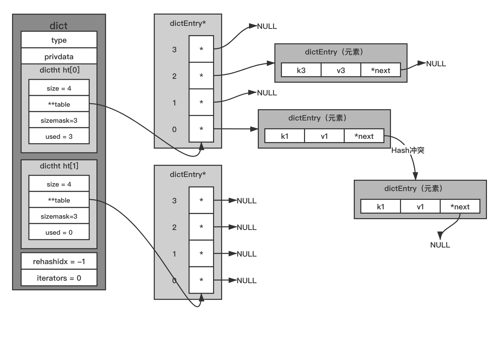
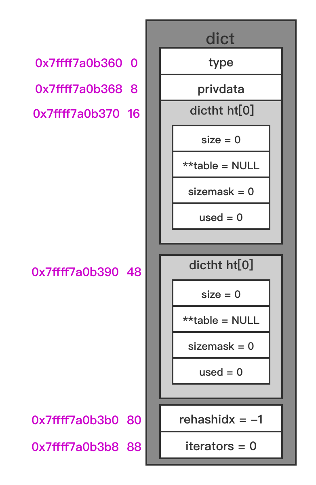
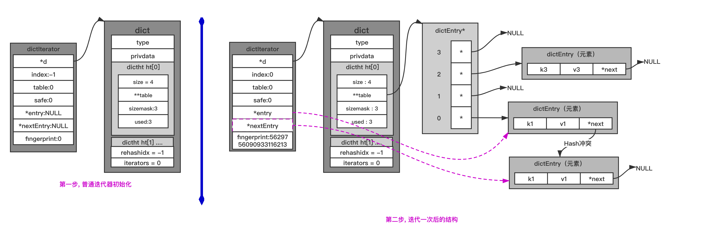

# 字典 HashMap

### 1. 关于Hash函数

> Hash作用是把任意长度的输入通过散列算法转换成固定类型、固定长度的散列值（即整型数据）;
>
> 好的Hash算法是经过Hash计算后其输出值具有强随机分布性。如"times 33"算法，它的核心算法是：
>
> "hash(i) = hash(i-1)*33 + str[i]"； 它是针对字符串已知的最好的散列函数之一； 

> Redis自带的客户端就是使用"times 33"散列函数来计算字符串的hash值； 而Redis服务器的Hash函数采用的是siphash算法，它的实现比较复杂；因此这里以客户端Hash函数作为示例；

```c
// 按目前Redis-5.0.0版本, 在dict.c中的 dictGenHashFunction函数的实现好像都采用了 siphash算法;
// 所以如下函数实现可以当作一个示例来理解 "times 33"这种算法
static unsigned in dictGenHashFunction(const unsigned char *buf, int len) {
  unsigned int hash = 5381;
  while(len--) {
    hash = ((hash<<5) + hash) + (*buff++); /* hash*33 + c */
  }
  
  return hash;
}
```


### 2. Redis字典的数据结构



#### 2.1 相关结构定义

```C
//dict.h
typedef struct dict { //Redis中的字典, 封装了Hash表; 当字典进行特殊操作时要用到里面的辅助字段;
    dictType *type; //字典对应的特定操作函数集合
    void *privdata; //本字典依赖的数据
  
    //Hash表, 键值对存储在这里; 一般情况只会用到ht[0]; 只有字典进行rehash时, 才会用到ht[1] 
    dictht ht[2];   
      /*
    关于rehashidx字段: 默认值为-1, 标识未进行rehash操作; 不为-1时, 代表正在进行rehash操作; 
    此时它存储的值表示Hash表 ht[0]的 rehash操作进行到了哪个索引值;
    */
    long rehashidx; /* rehashing not in progress if rehashidx == -1 */
  
    //当前运行的安全迭代器数; 当有安全迭代器绑定到该字典时, 会暂停rehash操作; 如执行keys命令时, 会创建安全迭代器
    //与安全迭代器对应的是普通迭代器, 如sort命令时会创建普通迭代器; 它们的区别会在下面说明;
    unsigned long iterators; /* number of iterators currently running */
} dict;

typedef struct dictType {
    uint64_t (*hashFunction)(const void *key); //字典对应的Hash函数
    void *(*keyDup)(void *privdata, const void *key); //键对应的复制函数
    void *(*valDup)(void *privdata, const void *obj); //值对应的复制函数
    int (*keyCompare)(void *privdata, const void *key1, const void *key2);//键的比对函数
    void (*keyDestructor)(void *privdata, void *key); //键的销毁函数
    void (*valDestructor)(void *privdata, void *obj); //值的销毁函数
} dictType;

typedef struct dictht { //Hash表, 结构大小: 32字节
    dictEntry **table; //指针数组, 用于存储键值对
    unsigned long size; //table数组大小, 初始大小为4
    unsigned long sizemask; //掩码 sizemask = size - 1
    unsigned long used; //当前Hash表中已存元素的个数
} dictht;

typedef struct dictEntry { //Hash表节点, 结构大小: 24字节
    void *key;  //存储的键
    union {
        void *val;   //db.dict中的val
        uint64_t u64;
        int64_t s64;  //db.expires中存储过期时间
        double d;
    } v;          //值, 是个联合体
    struct dictEntry *next;    //当Hash冲突时, 指向冲突的元素, 形成单链表
} dictEntry;
```


### 3. 基本操作

```c
// dict.c 中的一些宏定义
#define dictIsRehashing(d) ((d)->rehashidx != -1) //当前字典是否在进行rehash操作;

#define dictSlots(d) ((d)->ht[0].size+(d)->ht[1].size) //字典中的Hash表数组长度之和;
#define dictSize(d) ((d)->ht[0].used+(d)->ht[1].used) //字典中的元素数量, 需要两个ht中的used字段之和;

#define dictHashKey(d, key) (d)->type->hashFunction(key) //调用dictType中定义的hash函数计算Hash值

#define dictGetKey(he) ((he)->key)  //访问dictEntry.key字段, 获取键值
#define dictGetVal(he) ((he)->v.val) //获取dictEntry.v联合中的value值
#define dictGetSignedIntegerVal(he) ((he)->v.s64)
#define dictGetUnsignedIntegerVal(he) ((he)->v.u64)
#define dictGetDoubleVal(he) ((he)->v.d)

// dict.c 中定义的只用于本文中调用的函数
static int _dictExpandIfNeeded(dict *ht); //检查是否需要扩容, 如果需要, 则执行扩容
static unsigned long _dictNextPower(unsigned long size); //不小于size的最小2的n次方数

//计算key应该添加到字典的索引值; 但如果key已存在的话, 会返回-1; 如果在rehashing中, 则返回在ht[1]中的索引值
static long _dictKeyIndex(dict *ht, const void *key, uint64_t hash, dictEntry **existing);
static int _dictInit(dict *ht, dictType *type, void *privDataPtr); //初始化字典, 其中的ht[]内容均置0
```


#### 3.1 字典初始化

```C
//dict.c
//逻辑是分配结构体的空间, 并将字段初始化为空
//需要注意的是 dict.ht 是数组, 而不是指针; 所以数组中的2个dictht结构体也属于dict大小的一部分;
dict *dictCreate(dictType *type, void *privDataPtr) {
    dict *d = zmalloc(sizeof(*d));

    _dictInit(d,type,privDataPtr);
    return d;
}

/* Initialize the hash table */
int _dictInit(dict *d, dictType *type,void *privDataPtr) {
    _dictReset(&d->ht[0]);
    _dictReset(&d->ht[1]);
    d->type = type;
    d->privdata = privDataPtr;
    d->rehashidx = -1;
    d->iterators = 0;
    return DICT_OK;
}

static void _dictReset(dictht *ht)
{
    ht->table = NULL;
    ht->size = 0;
    ht->sizemask = 0;
    ht->used = 0;
}
```

初始化之后的状态:




#### 3.2 添加或替换元素

> redis-server启动后，启动redis-cli连接之后，执行命令 “set k1 v1”; 
>
> Server端接收到命令后，最终会执行到 setKey(redisDb *db, robj *key, robj *val) 函数；它的大概流程如下：
>
> + 调用dictFind函数，查询键是否存在，是则调用 dbOverwrite 函数修改键值对，否则调用 dbAdd 函数添加；
> + dbAdd 最终调用 dict.h 中的 dictAdd函数插入键值对；
>
> 所以这里主要介绍 dictAdd 函数

```C
//dict.c
int dictAdd(dict *d, void *key, void *val){ //添加元素
    dictEntry *entry = dictAddRaw(d,key,NULL); //重要调用的函数

    if (!entry) return DICT_ERR; //字典中已包含key, 返回错误;
    dictSetVal(d, entry, val); //更新entry对应的值; 这里同样需要注意dict.type.valDup函数的影响;
    return DICT_OK;
}

//工具函数, 如果字典中不包含key, 创建新 dictEntry* 后返回;
//但如果字典中已包含了key, 则会返回NULL; 
dictEntry *dictAddRaw(dict *d, void *key, dictEntry **existing)
{
    long index;
    dictEntry *entry;
    dictht *ht;

    //检查 d->rehashidx 值是否为 -1; 目的是检查是否在进行rehash操作, 是则执行一次rehash
    if (dictIsRehashing(d)) _dictRehashStep(d); //关于rehash相关的操作, 都在下面进行说明

    // _dictKeyIndex函数, 查找键, 找到则直接返回 -1, 并且如果existing非null, 也把老节点存入existing字段;
    // 否则把新节点的索引值返回; 如果遇到Hash表容量不足, 则进行扩容; 
    // dictHashKey 函数见第3节开头工具函数说明
    if ((index = _dictKeyIndex(d, key, dictHashKey(d,key), existing)) == -1)
        return NULL;

    // 是否在进行rehash操作中, 是则插入至散列表ht[1]中, 否则插入至ht[0]
    ht = dictIsRehashing(d) ? &d->ht[1] : &d->ht[0];
  
    //创建dictEntry写入相关字段;
    entry = zmalloc(sizeof(*entry));
    entry->next = ht->table[index];
    ht->table[index] = entry;
  
    ht->used++; //更新对应的散列表的 used字段;

    //设置dictEntry的key字段; 一般是直接将entry.key字段设置为 key参数; 
    //但如果在 d中的dictType类型字段type中的keyDup函数不为null, 则会调用keyDup,根据key复制出新的值;
    dictSetKey(d, entry, key); 
    return entry;
}

/*
选择key需要放到的散列表索引处, 若找到, 则返回对应的index值; 
若在字典中已存在key这个键值, 则返回 -1; 并且在这种情况下, 如果existing不为NULL, 则将它指向对应的dictEntry指针; 

需要注意的是, 如果在本函数执行过程中, 字典处于rehashing状态的话, 返回的index一般都是属于ht[1]中的索引;
*/
static long _dictKeyIndex(dict *d, const void *key, uint64_t hash, dictEntry **existing)
{
    unsigned long idx, table;
    dictEntry *he;
    if (existing) *existing = NULL;

    //在_dictExpandIfNeeded函数中, 会检查是否需要扩容, 如需要, 则执行;
    if (_dictExpandIfNeeded(d) == DICT_ERR)
        return -1;
  
    for (table = 0; table <= 1; table++) {
        //根据hash值获取对应的索引值 idx; 
        //每次循环都重新计算idx, 因为ht[1]的size可能因为rehash原因发生了变化;
        idx = hash & d->ht[table].sizemask; 

        he = d->ht[table].table[idx];
        while(he) {
            //若对应idx处的链表中已存在对应的key键值, 则返回 -1; 若existing不为null, 还将existing指向它;
            if (key==he->key || dictCompareKeys(d, key, he->key)) {
                if (existing) *existing = he;
                return -1;
            }
            he = he->next;
        }
      
        //这行的逻辑是, 正常情况, 一般都使用ht[0]这个Hash表; 所以遍历ht[0]即可; 
        //但在ht[0] rehash发生的情况下, 也会往ht[1]中写入数据, 所以只有在rehash情况下, 才继续遍历ht[1]
        if (!dictIsRehashing(d)) break;
    }
    return idx;
}
```


##### 3.2.1 字典扩容

> 在3.1字典初始化中，dict内部的ht[]数组中的每个dictht 的 size/sizemask/used 字段的值都被设置为0；
>
> 那么新添加元素时是什么时候分配数组的?  在 _dictExpandIfNeeded 函数中； 
>
> 参考上面的代码 _dictExpandIfNeeded 是在 _dictKeyIndex 函数中调用的，所以按照逻辑, 每次添加元素时都会检查散列表是否需要扩容；

```c
// dict.c
/*
检测是否需要初始化或扩容新hashtable, 如果是, 则调用dictExpand()函数进行扩容
扩容的主要流程: 
1. 如果未被初始化过, ht[0].size为0, 则为ht[0].table分配空间, 初始默认table size为4;
	如果曾经初始化过, 即ht[0].size不为0, 则为ht[1].table分配空间, ht[1].table size为ht[0].size * 2; 
2. 若为新申请的内存地址赋值为ht[1],并把字典的rehashidx标识由 -1改为0,表示之后需要进行rehash操作; 
*/
static int _dictExpandIfNeeded(dict *d)
{
    if (dictIsRehashing(d)) return DICT_OK; //在rehash过程中, 直接返回;

    // 如果字典刚初始化完成, 将ht[0]的size设置为4;
    if (d->ht[0].size == 0) return dictExpand(d, DICT_HT_INITIAL_SIZE);

    // 检查 used 与 size关系; 若达到一定条件, 则执行扩容;
    if (d->ht[0].used >= d->ht[0].size &&
        (dict_can_resize || d->ht[0].used/d->ht[0].size > dict_force_resize_ratio)) {
        return dictExpand(d, d->ht[0].used*2);
    }
    return DICT_OK;
}

//实际的扩容函数, 传入的参数不一定就是最终设置的table长度, 因为长度值必须是2的n次方;
//一般传入的size值为 used*2;  在第一次扩容时,size值为4; 
int dictExpand(dict *d, unsigned long size)
{
    //传入的size参数必须大于used字段值
    if (dictIsRehashing(d) || d->ht[0].used > size)
        return DICT_ERR;

    dictht n;
    unsigned long realsize = _dictNextPower(size); //查找不小于size的是接近的2的n次方;

    if (realsize == d->ht[0].size) return DICT_ERR; //size不变, 没有意义

    //为局部变量dictht n 设置对应的字段值, 并分配table空间;
    n.size = realsize;
    n.sizemask = realsize-1;
    n.table = zcalloc(realsize*sizeof(dictEntry*));
    n.used = 0;

    //如果字典初始化之后的第一次扩容, 则只设置ht[0]; 此时ht[1]仍为NULL; 
    if (d->ht[0].table == NULL) {
        d->ht[0] = n;
        return DICT_OK;
    }

    d->ht[1] = n; //非第一次扩容的情况下, 则只更新ht[1]内容; 
    d->rehashidx = 0; //而在更新ht[1]之后, 更新rehashidx, 标识在rehash过程中; 
    return DICT_OK;
}
```

> 字典扩容后，容量和掩码值会发生变化，同一个键与掩码经位运算后得到的索引值就会发生变化，从而导致根据键查找不到值的情况；解决问题的方法是：新扩容的内存放到一个全新的Hash表中(ht[1])，并给字典打上在进行rehash操作中的标识； **此后， 新添加的键值对都往新的Hash表中存储；而修改、删除、查找操作需要在ht[0]、ht[1]中进行检查，然后再决定去对哪个Hash表操作；**
>
> **除此之外，还需要把老Hash表(ht[0])中的数据重新计算索引值后全部迁移插入到新的Hash表(ht[1])中，此迁移过程称作rehash;**


##### 3.2.2 渐近式 rehash

> rehash除了扩容时会触发，缩空时也会触发；Redisk上rehash的实现，主要分为如下几步：
>
> 1. 给ht[1]申请足够的空间; 扩容时空间大小为当前容量*2, 即 d->ht[0].used\*2 ; 当使用量不到总空间10%时, 则进行缩容; 缩容时空间大小则为能恰好包含 d->ht[0].used 个节点的 2的N次幂整数, 并把字典中字段 rehashidx标识为0;
> 2. 进行rehash操作调用的是 **dictRehash** 函数, 重新计算 ht[0] 中每个键的 Hash值与索引值(重新计算就叫rehash), 依次添加到新的Hash表 ht[1], 并把老Hash表中该键值对删除. 把字典中字段 rehashidx 字段修改为 Hash表 ht[0] 中正在进行rehash 操作节点的索引值; 
> 3. rehash操作后, 清空 ht[0], 然后对调一下 ht[1] 与 ht[0], 并把字典中 rehashidx 字段标识为 -1;

```c
//dict.c

//本函数是在 dictAddRaw添加元素时, 在检查到正在rehash过程中时, 会先调用本函数执行一次rehash
static void _dictRehashStep(dict *d) {
    if (d->iterators == 0) dictRehash(d,1);
}

/*
Redis利用分而治之的思想进行rehash操作, 以防止数据量大时导致rehash执行时间太长;

执行插入、删除、查找、修改等操作前, 都先判断当前字典rehash操作是否在进行中, 进行中则调用dictRehashStep函进行rehash操作(每次只对1个节点进行rehash操作, 共执行1次); 如 dictAddRaw函数中;

除这些操作之外, 当服务空闲时, 如果当前字典也需要进行rehash操作,则调用incrementallyRehash函数进行批量rehash操作(每次对100个节点进行rehash操作, 共执行1毫秒). 在经历N次rehash操作后, 整个ht[0]的数据都会迁移到ht[1]中, 这样做的好处就是把本应集中处理的时间分散到了上百万、千万、亿次操作中, 所以其耗时可忽略不计;

返回值为0时, 表示迁移已完成; 返回值为1时, 表示还有剩余的keys没有移动到新的散列表; 
*/
int dictRehash(dict *d, int n) {
    int empty_visits = n*10; /* Max number of empty buckets to visit. */
    if (!dictIsRehashing(d)) return 0;

    /*
    参数n 和 局部变量 empty_visits 的作用: 
    参数n : 本次rehash过程最多处理table节点的数量;
    empty_visits : 在遍历ht[0].table过程中, 可能会遇到对应的节点为NULL的情况; 本变量标识在处理n个节点的过程中, 最多允许遇到几个NULL节点; 如果达到这个限制, 循环会跳过参数n的限制, 直接返回1; 
    */
    while(n-- && d->ht[0].used != 0) {
        dictEntry *de, *nextde;

        //rehashidx字段的意义是在rehash过程中时, 它的值则代表了ht[0]中正在执行迁移的索引值;
        //所以在设置rehash标识时, 它的值都是从0开始, 之后ht[0].table[0]处链表迁移完后, rehash值再依次递增;
        //所以rehashidx必定不能大于ht[0].size
        assert(d->ht[0].size > (unsigned long)d->rehashidx);
      
        //由于在外层while循环中包含了对 "ht[0].used != 0"的判断, 所以这里不用担心rehashidx超过table size;
        while(d->ht[0].table[d->rehashidx] == NULL) {
            d->rehashidx++;
          
            //rehashidx每增加1, 则表示处理完成一个slot(即例rehashidx处没有数据需要迁移, 也表示完成一个slot)
            //若已达到本函数要处理的可空bucket上限, 则返回;
            if (--empty_visits == 0) return 1; 
        }
      
        de = d->ht[0].table[d->rehashidx]; //找到ht[0].table中的非NULL开头索引处的链表头;

        //遍历以de开头的链表, 将它加入到ht[1]中的对应链表中; 
        //需要注意的是在rehash时, ht[1]和ht[0]的size和sizemask都不同, 所以需要重新计算它在ht[1]中的index
        while(de) {
            uint64_t h;

            nextde = de->next;
            /* Get the index in the new hash table */
            h = dictHashKey(d, de->key) & d->ht[1].sizemask;
            de->next = d->ht[1].table[h];
            d->ht[1].table[h] = de;
            d->ht[0].used--;
            d->ht[1].used++;
            de = nextde;
        }
        d->ht[0].table[d->rehashidx] = NULL;
        d->rehashidx++;
    }

    //如果已迁移完成所有dictEntry, 将ht[0] 和 ht[1] 互换, 清空ht[1]并设置rehashidx为 -1; 
    //此外, 返回0, 表示迁移完成;
    if (d->ht[0].used == 0) {
        zfree(d->ht[0].table);
        d->ht[0] = d->ht[1];
        _dictReset(&d->ht[1]);
        d->rehashidx = -1;
        return 0;
    }
    
    return 1; //返回1表示还未全部完成rehash过程
}

//---- dictRehashMilliseconds() 在ms参数限制时间内, 执行渐近式rehash;
long long timeInMilliseconds(void) {
    struct timeval tv;

    gettimeofday(&tv,NULL);
    return (((long long)tv.tv_sec)*1000)+(tv.tv_usec/1000);
}

/* Rehash for an amount of time between ms milliseconds and ms+1 milliseconds */
int dictRehashMilliseconds(dict *d, int ms) {
    long long start = timeInMilliseconds();
    int rehashes = 0;

    while(dictRehash(d,100)) {
        rehashes += 100;
        if (timeInMilliseconds()-start > ms) break;
    }
    return rehashes;
}
```


##### 3.2.3 添加或替换

```c
int dictReplace(dict *d, void *key, void *val)
{
    dictEntry *entry, *existing, auxentry;

    /* Try to add the element. If the key does not exists dictAdd will succeed. */
    entry = dictAddRaw(d,key,&existing);
    if (entry) {
        dictSetVal(d, entry, val);
        return 1;
    }

    /* Set the new value and free the old one. Note that it is important
     * to do that in this order, as the value may just be exactly the same
     * as the previous one. In this context, think to reference counting,
     * you want to increment (set), and then decrement (free), and not the
     * reverse. */
    auxentry = *existing;
    dictSetVal(d, existing, val);
    dictFreeVal(d, &auxentry);
    return 0;
}

dictEntry *dictAddOrFind(dict *d, void *key) { //添加或查找; 返回新添加的entry或者已存在的entry
    dictEntry *entry, *existing;
    entry = dictAddRaw(d,key,&existing);
    return entry ? entry : existing;
}
```


#### 3.3 查找元素

```c
//dict.c
//方法体中调用的函数以及其作用, 前面已经做过解释, 所以本函数的逻辑比较简单
dictEntry *dictFind(dict *d, const void *key)
{
    dictEntry *he;
    uint64_t h, idx, table;

    if (d->ht[0].used + d->ht[1].used == 0) return NULL; /* dict is empty */
    if (dictIsRehashing(d)) _dictRehashStep(d);
    h = dictHashKey(d, key);
    for (table = 0; table <= 1; table++) {
        idx = h & d->ht[table].sizemask;
        he = d->ht[table].table[idx];
        while(he) {
            if (key==he->key || dictCompareKeys(d, key, he->key))
                return he;
            he = he->next;
        }
        if (!dictIsRehashing(d)) return NULL;
    }
    return NULL;
}
```


#### 3.4 修改元素

```c
//db.c
/*
1. 调用dictFind查找键是否存在; 2. 不存在则中断执行; 3. 修改节点键值对中的值为新值; 4. 释放旧值内存;
*/
void dbOverwrite(redisDb *db, robj *key, robj *val) {
    dictEntry *de = dictFind(db->dict,key->ptr);

    serverAssertWithInfo(NULL,key,de != NULL);
    dictEntry auxentry = *de;
    robj *old = dictGetVal(de);
    if (server.maxmemory_policy & MAXMEMORY_FLAG_LFU) {
        val->lru = old->lru;
    }
    dictSetVal(db->dict, de, val);

    if (server.lazyfree_lazy_server_del) {
        freeObjAsync(old);
        dictSetVal(db->dict, &auxentry, NULL);
    }

    dictFreeVal(db->dict, &auxentry);
}
```


#### 3.5 删除元素

```c
// dict.c
int dictDelete(dict *ht, const void *key) {
    return dictGenericDelete(ht,key,0) ? DICT_OK : DICT_ERR;
}

//内部用于删除key对应的Entry的函数, nofree参数用于标识是否保留找到的Entry的空间, 如果为false, 则会释放entry空间
static dictEntry *dictGenericDelete(dict *d, const void *key, int nofree) {
    uint64_t h, idx;
    dictEntry *he, *prevHe;
    int table;

    if (d->ht[0].used == 0 && d->ht[1].used == 0) return NULL;

    if (dictIsRehashing(d)) _dictRehashStep(d);
    h = dictHashKey(d, key);

    for (table = 0; table <= 1; table++) {
        idx = h & d->ht[table].sizemask;
        he = d->ht[table].table[idx];
        prevHe = NULL;
        while(he) {
            if (key==he->key || dictCompareKeys(d, key, he->key)) {
                /* Unlink the element from the list */
                if (prevHe)
                    prevHe->next = he->next;
                else
                    d->ht[table].table[idx] = he->next;
                if (!nofree) {
                    dictFreeKey(d, he);
                    dictFreeVal(d, he);
                    zfree(he);
                }
                d->ht[table].used--;
                return he;
            }
            prevHe = he;
            he = he->next;
        }
        if (!dictIsRehashing(d)) break;
    }
    return NULL;
}

//--- 从字典链表中移除key对应的entry, 但不释放该entry对应的空间; 可以在后面调用dictFreeUnlinkedEntry来手动释放
dictEntry *dictUnlink(dict *ht, const void *key) {
    return dictGenericDelete(ht,key,1);
}

void dictFreeUnlinkedEntry(dict *d, dictEntry *he) {
    if (he == NULL) return;
    dictFreeKey(d, he);
    dictFreeVal(d, he);
    zfree(he);
}
```


#### 3.6 字典缩容

> 在字典经过一系列操作后, 使用量不到总空间<10%时, 就会进行缩容操作;
>
> 字典缩容的核心函数有两个:  **tryResizeHashTables & dictResize**
>
> **缩容同样是通过 dictExpand() 函数实现，只是传入的size参数是比 ht[0].size 更小的值**

```c
//server.c
void tryResizeHashTables(int dbid) {
    if (htNeedsResize(server.db[dbid].dict))
        dictResize(server.db[dbid].dict);
    if (htNeedsResize(server.db[dbid].expires))
        dictResize(server.db[dbid].expires);
}

int htNeedsResize(dict *dict) {
    long long size, used;

    size = dictSlots(dict);
    used = dictSize(dict);
    //DICT_HT_INITIAL_SIZE=4; HASHTABLE_MIN_FILL=10;
    return (size > DICT_HT_INITIAL_SIZE && (used*100/size < HASHTABLE_MIN_FILL));
}

// dict.c
int dictResize(dict *d) {
    int minimal;

    if (!dict_can_resize || dictIsRehashing(d)) return DICT_ERR;
    minimal = d->ht[0].used;
    if (minimal < DICT_HT_INITIAL_SIZE)
        minimal = DICT_HT_INITIAL_SIZE;
    return dictExpand(d, minimal); //缩容时也是调用dictExpand函数;
}
```


#### 3.7 字典遍历

> 字典遍历的原则为: 1. 不重复出现数据; 2. 不遗漏任何数据; 
>
> Redis遍历数据库有两种方式: **全遍历(keys命令) & 间断遍历(hscan命令)**
>
> 全遍历: 一次命令执行就遍历完整个数据库;
>
> 间断遍历: 每次命令执行只取部分数据, 分多次遍历;

##### 3.7.1迭代器遍历 (迭代器遍历就属于全遍历)

> 迭代器遍历时需要解决一个问题：**在迭代过程中，如果发生数据增删，可能导致rehash操作；或者迭代开始时字典就在执行rehash操作， 会出现一条数据被多次遍历到；**
>
> 需要解释的是， 由于Redis是单进程单线程模式， 不存在两个命令同时执行的情况；  因此上面说的**在迭代命令执行过程的同时删除了数据, 才会触发上面的问题；**
>
> 根据迭代器遍历数据, 将迭代器分为两类: 
>
> **普通迭代器： 只遍历数据**
>
> **安全迭代器：遍历的同时可删除数据;**

```c
// dict.h
//迭代器数据结构, 结构大小48字节;
typedef struct dictIterator {
    dict *d;  //迭代的字典
    long index;  //当前迭代到Hash表中哪个索引值
    int table, safe;  //table用于表示当前正在迭代的Hash表(ht[0]或ht[1]); safe表示当前是否是安全迭代器;
    dictEntry *entry, *nextEntry; //当前结点和下一个节点
    /* unsafe iterator fingerprint for misuse detection. */
    //关于fingerprint的计算, 参考dict.c 中的dictFingerprint函数
    long long fingerprint; //字典指纹, 当字典未发生改变时, 本值不变; 发生改变时, 本值也会变化;
} dictIterator;

//dict.h
//迭代器相关API函数, 具体实现参考dict.c
dictIterator *dictGetIterator(dict *d);
dictIterator *dictGetSafeIterator(dict *d);
dictEntry *dictNext(dictIterator *iter);
void dictReleaseIterator(dictIterator *iter);
```


##### 3.7.2 普通迭代器

> 普通迭代器在遍历字典时, **会对迭代器中 fingerprint 字段的值作严格校验**, 以保证迭代过程中字典数据未发生变化;
>
> Redis 执行部分命令时会使用普通迭代器, 如sort命令； sort命令主要作用是对给定表表、集合、有序集合的元素进行排序, 如果给定的是有序集合， 其成员名存储用的是字典； 分值存储用的是跳跃表, 则执行sort命令读取数据的时候会用到迭代器来遍历整个字典; 
>
> 普通迭代器过程: 
>
> 1. **调用dictGetIterator 函数初始化一个普通迭代器, 此时会把 iter->safe 值置为0, 表示初始化的是普通迭代器;**
> 2. **循环调用 dictNext 函数依次遍历字典中Hash表的节点, 首次遍历时会通过 dictFingerprint函数拿到当前字典的指纹值;**
> 3. **当调用dictNext函数遍历完字典Hash表节点数据后, 释放迭代器时会继续调用 dictFingerprint函数计算指纹值, 并与首次拿到的指纹值比较, 不相等则输出异常 "=== ASSERTION FAILED ===", 并退出程序执行;**
>
> > **通过步骤2、3的指纹值比较, 来限制整个迭代过程中只能进行迭代操作, 即迭代过程中字典数据的修改、添加、删除、查找等操作都不能进行, 只能调用dictNext函数迭代整个字典, 否则就报异常;**
>>
> > **对字典进行修改、添加、删除、查找操作都会调用dictRehashStep函数, 进行渐近式rehash操作, 从而导致fingerprint值发生改变;**



```c
//dict.c
//--- 普通迭代器

long long dictFingerprint(dict *d) { //计算字典对应的fingerprint
    long long integers[6], hash = 0;
    int j;

    integers[0] = (long) d->ht[0].table;
    integers[1] = d->ht[0].size;
    integers[2] = d->ht[0].used;
    integers[3] = (long) d->ht[1].table;
    integers[4] = d->ht[1].size;
    integers[5] = d->ht[1].used;

    for (j = 0; j < 6; j++) {
        hash += integers[j];
        /* For the hashing step we use Tomas Wang's 64 bit integer hash. */
        hash = (~hash) + (hash << 21); // hash = (hash << 21) - hash - 1;
        hash = hash ^ (hash >> 24);
        hash = (hash + (hash << 3)) + (hash << 8); // hash * 265
        hash = hash ^ (hash >> 14);
        hash = (hash + (hash << 2)) + (hash << 4); // hash * 21
        hash = hash ^ (hash >> 28);
        hash = hash + (hash << 31);
    }
    return hash;
}

dictIterator *dictGetIterator(dict *d) //获取普通迭代器
{
    dictIterator *iter = zmalloc(sizeof(*iter));

    iter->d = d;
    iter->table = 0;
    iter->index = -1;
    iter->safe = 0;
    iter->entry = NULL;
    iter->nextEntry = NULL;
    return iter;
}

//每次调用dictNext, 都会从字典中获取下一个entry并赋值给iter->entry字段;
dictEntry *dictNext(dictIterator *iter) 
{
    while (1) {
        if (iter->entry == NULL) {
            dictht *ht = &iter->d->ht[iter->table];
            if (iter->index == -1 && iter->table == 0) {
                if (iter->safe)
                    iter->d->iterators++; //对于安全迭代器, 更新字典的iterators字段, 以防止rehash
                else
                    iter->fingerprint = dictFingerprint(iter->d); //首次迭代, 计算fingerprint
            }
            iter->index++;
            if (iter->index >= (long) ht->size) {
                if (dictIsRehashing(iter->d) && iter->table == 0) {
                    iter->table++;
                    iter->index = 0;
                    ht = &iter->d->ht[1];
                } else {
                    break;
                }
            }
            iter->entry = ht->table[iter->index];
        } else {
            iter->entry = iter->nextEntry;
        }
        if (iter->entry) {
            /* We need to save the 'next' here, the iterator user
             * may delete the entry we are returning. */
            iter->nextEntry = iter->entry->next;
            return iter->entry;
        }
    }
    return NULL;
}

// 迭代完成, 对于普通迭代器, 会重新计算fingerprint后与迭代开始时的fingerprint对比, 如果不同, 则报错
void dictReleaseIterator(dictIterator *iter) 
{
    if (!(iter->index == -1 && iter->table == 0)) {
        if (iter->safe)
            iter->d->iterators--;
        else
            assert(iter->fingerprint == dictFingerprint(iter->d));
    }
    zfree(iter);
}
```


##### 3.7.3 安全迭代器

> 安全迭代器原理与普通迭代器类似, 也是通过循环调用dictNext函数依次遍历字典中的Hash表节点;
>
> 安全迭代器确何读取数据的准确性, **不是通过限制字典的部分操作来实现的, 而是通过限制rehash的进行来确保, **所以在迭代过程中可心进行增删查改操作;
>
> > 在对字典进行增删查改操作会调用**_dictRehashStep** 函数进行渐近式 rehash操作, 那应该通过什么方法限制rehash呢; 
> >
> > 参考 _dictRehashStep 函数: 
> >
> > ```c
> > static void _dictRehashStep(dict *d) {
> >     if (d->iterators == 0) dictRehash(d,1);
> > }
> > ```
> >
> > **所以原理上很简单, 如果当前字典有安全迭代器运行, 则不进行渐近式rehash操作,  rehash操作暂停, 字典中数据就不会被重复遍历, 由此确保了读取数据的准确性;**
>
>
> 当Redis执行部分命令时会使用安全迭代器迭代字典数据, 例如 keys 命令;  keys命令主要作用是通过模式匹配, 返回给定模式的所有 key列表, 遇到过期的键则会进行删除操作; Redis数据键值对都存储在字典里, 因此keys命令会通过安全迭代器来遍历整个字典, 它的步骤主要如下:
>
> 1. **调用 dictGetSafeIterator 函数初始化一个安全迭代器, 此时会把iter->safe 值置为1, 表示初始化的迭代器为安全迭代器;**
> 2. **循环调用 dictNext 函数依次遍历字典中Hash表节点, 首次遍历时会把字典中 iterators 字段进行 "加1" 操作, 确保迭代过程中渐近式 rehash操作会被中断执行; **
> 3. **迭代完成后, 释放迭代器时会把字典中 iterators 字段进行 "减1"操作;**

```c
dictIterator *dictGetSafeIterator(dict *d) {
    dictIterator *i = dictGetIterator(d);

    i->safe = 1;
    return i;
}

//其它逻辑参考上面的 dictNext 和 dictReleaseIterator 函数逻辑
```


##### 3.7.4 间断遍历 （还需要整理）

> 全遍历的问题: 当数据库中数据量很大时, 执行keys命令进行一次数据库遍历, 耗时太长, 会造成Redis短暂不可用;
>
> 所以Redis 之后引入了scan操作, 即"间断遍历";  对应的函数为**"dictScan"**;
>
> **可用的scan命令, 如: hscan命令迭代整个数据库中的key; zscan命令迭代有序集合所有成员与值;**
>
> **此外, 需要注意的是 dictScan遍历字典过程中是可以进行 rehash 操作的;**
>
> > 关于dictScan，参考: http://www.langdebuqing.com/redis%20notebook/redis%E6%BA%90%E7%A0%81%E9%9A%BE%E7%82%B9%EF%BC%9A%E5%AD%97%E5%85%B8%E7%9A%84%E9%81%8D%E5%8E%86dictScan.html

```c
// dict.c

//工具函数, 算法来自 http://graphics.stanford.edu/~seander/bithacks.html#ReverseParallel
static unsigned long rev(unsigned long v) {
    unsigned long s = 8 * sizeof(v); // bit size; must be power of 2
    unsigned long mask = ~0;
    while ((s >>= 1) > 0) {
        mask ^= (mask << s);
        v = ((v >> s) & mask) | ((v << s) & ~mask);
    }
    return v;
}

/*
原英文注释解释的比较详细, 以下为部分摘录:
1) 开始时调用本函数, 游标值v值为0
2) 函数执行一次迭代, 并且返回新游标值, 这个值需要作为下次调用dictScan函数时的参数传入
3) 当dictScan返回值为0时, 表示迭代完成

dictScan保证字典中的所有entry都会被迭代到, 但是却可能出现某些entry被迭代多次;

每次迭代到entry, 都会调用回调参数 fn(privdata, entry) 进行处理;

工作原理: 
迭代算法由 Pieter Noordhuis 设计;  中心思想是increment a cursor starting from the higher order bits; That is, instead of incrementing the cursor normally, the bits of the cursor are reversed, then the cursor is incremented, and finally the bits are reversed again;
*/
/*
参数说明:
d: 当前字典; v: 标识迭代开始的游标(即Hash表中数组索引), 每次遍历后会返加新的游标值; 
fn: 每遍历一个节点, 即调用本函数处理; bucketfn: 整理碎片时调用; privdata: fn函数所需参数;
*/
unsigned long dictScan(dict *d,unsigned long v,dictScanFunction *fn,
                       dictScanBucketFunction* bucketfn, void *privdata){
    dictht *t0, *t1;
    const dictEntry *de, *next;
    unsigned long m0, m1;

    if (dictSize(d) == 0) return 0;

    if (!dictIsRehashing(d)) {
        t0 = &(d->ht[0]);
        m0 = t0->sizemask;

        /* Emit entries at cursor */
        if (bucketfn) bucketfn(privdata, &t0->table[v & m0]);
        de = t0->table[v & m0];
        while (de) {
            next = de->next;
            fn(privdata, de);
            de = next;
        }

        /* Set unmasked bits so incrementing the reversed cursor
         * operates on the masked bits */
        v |= ~m0;

        /* Increment the reverse cursor */
        v = rev(v);
        v++;
        v = rev(v);

    } else {
        t0 = &d->ht[0];
        t1 = &d->ht[1];
        
        /* Make sure t0 is the smaller and t1 is the bigger table */
        if (t0->size > t1->size) {
            t0 = &d->ht[1];
            t1 = &d->ht[0];
        }

        m0 = t0->sizemask;
        m1 = t1->sizemask;

        /* Emit entries at cursor */
        if (bucketfn) bucketfn(privdata, &t0->table[v & m0]);
        de = t0->table[v & m0];
        while (de) {
            next = de->next;
            fn(privdata, de);
            de = next;
        }

        /* Iterate over indices in larger table that are the expansion
         * of the index pointed to by the cursor in the smaller table */
        do {
            /* Emit entries at cursor */
            if (bucketfn) bucketfn(privdata, &t1->table[v & m1]);
            de = t1->table[v & m1];
            while (de) {
                next = de->next;
                fn(privdata, de);
                de = next;
            }

            /* Increment the reverse cursor not covered by the smaller mask.*/
            v |= ~m1;
            v = rev(v);
            v++;
            v = rev(v);
          
            /* Continue while bits covered by mask difference is non-zero */
        } while (v & (m0 ^ m1));
    }

    return v;
}
```


###### 3.7.4.1 dictScan应用示例 

> 以 hscan 命令为例, 它会依次调用  **t_hash.c#hscanCommand -> db.c#scanGenericCommand 函数**
>
> 在 scanGenericCommand 函数体中, 包含如下几行: 
>
> ```c
> //db.c
> void scanGenericCommand(client *c, robj *o, unsigned long cursor) {
>   //...
>   if (ht) {
>         void *privdata[2];
>         /* We set the max number of iterations to ten times the specified
>          * COUNT, so if the hash table is in a pathological state (very
>          * sparsely populated) we avoid to block too much time at the cost
>          * of returning no or very few elements. */
>         long maxiterations = count*10;
> 
>         /* We pass two pointers to the callback: the list to which it will
>          * add new elements, and the object containing the dictionary so that
>          * it is possible to fetch more data in a type-dependent way. */
>         privdata[0] = keys;
>         privdata[1] = o;
>         do {
>             cursor = dictScan(ht, cursor, scanCallback, NULL, privdata);
>         } while (cursor && maxiterations-- && listLength(keys) < (unsigned long)count);
>   }
>   //..
> }
> ```


###### 3.4.2.2 说明

> 在 dictScan 函数间断遍历字典过程中会遇到如下 3 种情况:
>
> 1. 从迭代开始到结束, 散列表没有进行rehash 操作;
>
>    > **只需要依序遍历ht[0]即可;**
>
> 2. 从迭代开始到结束, 散列表进行了扩容或缩容操作, 且恰好为两次迭代间隔期间完成了 rehash 操作;
>
>    > 举例子: 在第一次间隔遍历, 散列表size=4, 而开始索引为0; 而当第二次间隔遍历时, 散列表rehash后size变为8,且遍历索引小于4;  则对应的原index到现index的映射关系为: 0=>[0,4]; 1=>[1,5]; 2=>[2,6]; 3=>[3,7];  
>    >
>    > 按上面的例子, 可能会出现**第一次遍历时处理index=0时的节点, 而到第二次遍历时, 原index=0处的节点有部分移到了index=4处; 这样就会出现重复遍历的问题; **
>    >
>    > Redis 采用了**"reverse binary iteration"方法来解决这个问题;**
>    >
>    > **但是这种情况下, 如果rehash扩容了, 不会导致重复遍历; 但如果两次遍历中间经历了缩容, 可能会导致重复遍历的情况;**
>
> 3. 从迭代开始到结束, 某次或某几次迭代时散列表正在进行 rehash 操作;
>
>    > **两个表先后遍历, 具体逻辑后续;**

