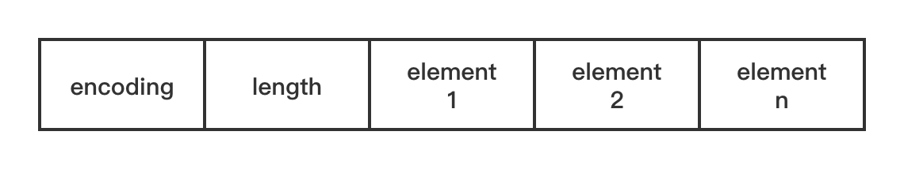

# 整数集合

> 整数集合(intset)是一个有序的、存储整型数据的结构; 
>
> **当Redis集合类型的元素都是整数并且都处在64位有符号整数范围之内时, 使用该结构体存储;**


> 在两种情况下, Redis会转变整数集合的底层编码:
>
> 1. **当元素个数超过一定数量之后(默认值为512), 即使元素类型仍然是整型, 也会将编码转换为 hashtable;**
>
>    > **由 set-max-intset-entries 512  配置;**
>
> 2. **往集合中增加非整型变量**
>
>    > \> sadd testSet 'a'
>    >
>    > \> object encoding testSet
>    >
>    > "hashtable"


### 1. 数据存储

> 整数集合可以保存 int16_t、 int32_t、int64_t 类型的整型数据, 并保证集合中不会出现重复数据;
>
> 整数集合对应的 **intset** 类型数据结构

```c
//intset.h
typedef struct intset {
    uint32_t encoding; //编码类型
    uint32_t length;   //元素个数
    int8_t contents[];  //柔性数组, 根据encoding字段决定几个字节表示一个元素
} intset;
```



#### 1.1 encoding字段

> 表示编码类型, 决定每个元素占用几个字节, 有3种类型:
>
> 1. INTSET_ENC_INT16: 每个元素占2个字节; "#define INTSET_ENC_INT16 (sizeof(int16_t))"
> 2. INTSET_ENC_INT32: 每个元素占4个字节; "#define INTSET_ENC_INT32 (sizeof(int32_t))"
> 3. INTSET_ENC_INT64: 每个元素占8个字节; "#define INTSET_ENC_INT64 (sizeof(int64_t))"


#### 1.2 关于扩容

> 由于encoding有3种可能的类型,  那么就可能会出现新添加的元素超过了当前encoding的取值范围的情况;
>
> **此时 intset 就需要进行扩容, 即增加encoding的宽度, 同时还需要修改所有element的字节宽度;**
>
> > **注意: 上面就说明, 当待插入的值导致了intset扩容, 那么这个新值在intset中不是最大值就是最小值;**


#### 1.3 顺序问题

> **需要注意的是: intset中的元素是按大小顺序排列的, 所以新元素并非是直接在末尾直接添加的;**


### 2. 基本操作

#### 2.1 查询元素

```c
// intset.c
uint8_t intsetFind(intset *is, int64_t value) {
    uint8_t valenc = _intsetValueEncoding(value); // 判断value编码方式
  
    //如果value编码方式大于当前intset编码方式, 直接返回0; 否则调用intsetSearch查找
    return valenc <= intrev32ifbe(is->encoding) && intsetSearch(is,value,NULL);
}

//因为intset中的元素是按大小顺序排序的, 所以可以采用二分查找
//参数pos的作用是, 在添加新元素时, 可以通过intsetSearch查找元素, 若存在该值, 函数返回非0值;
//而若函数返回0值,  *pos中保存了新元素保存位置; 
static uint8_t intsetSearch(intset *is, int64_t value, uint32_t *pos) {
    int min = 0, max = intrev32ifbe(is->length)-1, mid = -1;
    int64_t cur = -1;

    if (intrev32ifbe(is->length) == 0) { //intset为空, 直接返回0
        if (pos) *pos = 0;
        return 0;
    } else {
        //value大于intset中的最大值 或 小于intset中的最小值, 都直接返回0;
        if (value > _intsetGet(is,intrev32ifbe(is->length)-1)) {
            if (pos) *pos = intrev32ifbe(is->length);
            return 0;
        } else if (value < _intsetGet(is,0)) {
            if (pos) *pos = 0;
            return 0;
        }
    }

    //二分查找;
    while(max >= min) {
        mid = ((unsigned int)min + (unsigned int)max) >> 1;
        cur = _intsetGet(is,mid);
        if (value > cur) {
            min = mid+1;
        } else if (value < cur) {
            max = mid-1;
        } else {
            break;
        }
    }

    if (value == cur) { //或找到值, 则返回1;
        if (pos) *pos = mid;
        return 1;
    } else { //返回0, *pos 存储添加位置;
        if (pos) *pos = min;
        return 0;
    }
}
```


#### 2.2 添加元素

```c
// intset.c
/* Insert an integer in the intset */
intset *intsetAdd(intset *is, int64_t value, uint8_t *success) {
    uint8_t valenc = _intsetValueEncoding(value);
    uint32_t pos;
    if (success) *success = 1;

    if (valenc > intrev32ifbe(is->encoding)) { 
			//如果新元素的encoding大于 intset原有的encoding值, 则调用intsetUpgradeAndAdd函数
      return intsetUpgradeAndAdd(is,value);
    } else {
				//通过intsetSearch查询对应的value是否已存在; 若返回1, 表示value已存在, 直接返回;
        //而若函数返回0, *pos即保存了value需要保存到的位置index
        if (intsetSearch(is,value,&pos)) {
            if (success) *success = 0;
            return is;
        }

      	//为intset重新分配内存, 为新元素增加一个位置; 此时只增加了空间, length值还是旧值;
        is = intsetResize(is,intrev32ifbe(is->length)+1);
      
        //如果pos指向了元素中间位置, 则将pos～结尾的所有元素, 均往后移动一个位置, 腾出一个位置用来写入value值;
        if (pos < intrev32ifbe(is->length)) intsetMoveTail(is,pos,pos+1);
    }

    _intsetSet(is,pos,value); //往pos处写入值
    is->length = intrev32ifbe(intrev32ifbe(is->length)+1); //更新length长度;
    return is;
}

//工具函数, 将from~结尾的元素 移到到 to开头位置处;
static void intsetMoveTail(intset *is, uint32_t from, uint32_t to) {
    void *src, *dst;
    uint32_t bytes = intrev32ifbe(is->length)-from;
    uint32_t encoding = intrev32ifbe(is->encoding);

    if (encoding == INTSET_ENC_INT64) {
        src = (int64_t*)is->contents+from;
        dst = (int64_t*)is->contents+to;
        bytes *= sizeof(int64_t);
    } else if (encoding == INTSET_ENC_INT32) {
        src = (int32_t*)is->contents+from;
        dst = (int32_t*)is->contents+to;
        bytes *= sizeof(int32_t);
    } else {
        src = (int16_t*)is->contents+from;
        dst = (int16_t*)is->contents+to;
        bytes *= sizeof(int16_t);
    }
    memmove(dst,src,bytes);
}

/* Upgrades the intset to a larger encoding and inserts the given integer. */
static intset *intsetUpgradeAndAdd(intset *is, int64_t value) {
    uint8_t curenc = intrev32ifbe(is->encoding); //当前encoding值
    uint8_t newenc = _intsetValueEncoding(value); //需要扩容的encoding值;
    int length = intrev32ifbe(is->length); //当前intset长度
  
    //根据前面的说明, 如果新元素导致intset扩容, 则这个新元素在intset中不是最大值就是最小值; 
    //所以如果value<0, 则它是最小值, 需要添加到开头位置; 如果value>0, 则它是最大值;
    //这里使用 prepend标识; 
    int prepend = value < 0 ? 1 : 0; 

    is->encoding = intrev32ifbe(newenc); //设置新encoding值;
  
    //重分配is的内存空间, 不但长度增加1, 而且每个元素分配的长度都变为新encoding指示的长度;
    is = intsetResize(is,intrev32ifbe(is->length)+1);

    //is是重新分配空间, 但原数据仍可按照原encoding进行读取, _intsetGetEncoded函数就是按旧encoding读取对应
    //位置处的值, 而 _intsetSet函数则是将值按新encoding写入 intset中;
    //这里通过prepend进行控制, 若value值小于0, 则每个元素均往后值一个位置; 而value若大于0, 则每个元素位置不变;
    //而且这里从最后一个元素开始遍历, 以防止元素覆盖;
    while(length--)
        _intsetSet(is,length+prepend,_intsetGetEncoded(is,length,curenc));

    //再根据prepend确定value是写到开头处还是结尾处;
    if (prepend)
        _intsetSet(is,0,value);
    else
        _intsetSet(is,intrev32ifbe(is->length),value);
    is->length = intrev32ifbe(intrev32ifbe(is->length)+1); //更新length;
    return is;
}

/* Resize the intset */ //工具函数
static intset *intsetResize(intset *is, uint32_t len) {
    uint32_t size = len*intrev32ifbe(is->encoding);
    is = zrealloc(is,sizeof(intset)+size);
    return is;
}
```


#### 2.3 删除元素

```c
// intset.c
/* Delete integer from intset */
//用到的工具函数作用见上面的说明; 大概逻辑比较容易理解;
intset *intsetRemove(intset *is, int64_t value, int *success) {
    uint8_t valenc = _intsetValueEncoding(value);
    uint32_t pos;
    if (success) *success = 0;

    if (valenc <= intrev32ifbe(is->encoding) && intsetSearch(is,value,&pos)) {
        uint32_t len = intrev32ifbe(is->length);

        /* We know we can delete */
        if (success) *success = 1;

        /* Overwrite value with tail and update length */
        if (pos < (len-1)) intsetMoveTail(is,pos+1,pos);
        is = intsetResize(is,len-1);
        is->length = intrev32ifbe(len-1);
    }
    return is;
}
```

