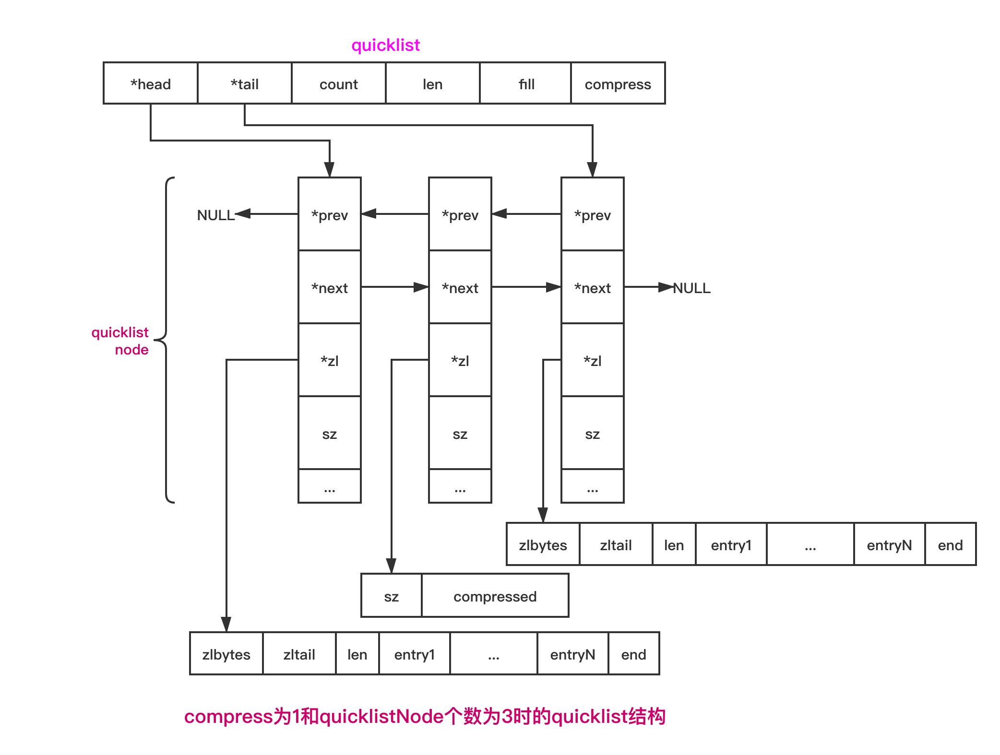

# quicklist的实现


### 1. 简介

> 在3.2版本之前, Redis使用压缩列表(ziplist)以及双向链表(addlist)作为List的底层实现; 当元素个数比较少且元素长度比较小时, Redis采用ziplist 作为其底层存储;  当任一条件不满足时,  改为采用adlist;  
>
> **这样做的原因主要是, ziplist可以有效节省存储, 但ziplist在空间上是连续的,  当元素个数多时,  修改元素时， 必须重新分配存储空间, 继面影响Redis的执行效率;  所以元素个数多时, 采用双向链表;**
>
> **3.2版本之后, Redis使用quicklist作为List的底层实现; 它是综合考虑了时间效率和空间效率而引入的数据结构;**


> 关于List, 在Redis 3.2版本前使用双向非循环链表结构;
>
> quicklist是一个双向链表, 链表中的每个节点是一个ziplist结构;
>
> 当ziplist节点个数过多,  quicklist退化为双向链表, 一个极端的情况就是每个ziplist节点只包含一个entry；
>
> 当ziplist元素个数过少时, quicklist可退化为ziplist, 一种极端情况就是 quiclist中只有一个ziplist节点;


### 2. 数据存储

```c
//quicklist.h
typedef struct quicklistNode {
    struct quicklistNode *prev;
    struct quicklistNode *next;
    unsigned char *zl;
    unsigned int sz;             /* ziplist size in bytes */
    unsigned int count : 16;     /* count of items in ziplist */
    unsigned int encoding : 2;   /* RAW==1 or LZF==2 */
    unsigned int container : 2;  /* NONE==1 or ZIPLIST==2 */
    unsigned int recompress : 1; /* was this node previous compressed? */
    unsigned int attempted_compress : 1; /* node can't compress; too small */
    unsigned int extra : 10; /* more bits to steal for future usage */
} quicklistNode;

//ziplist压缩之后的结构定义;
typedef struct quicklistLZF {
    unsigned int sz; /* LZF size in bytes*/
    char compressed[];
} quicklistLZF;

//表示quicklistNode中ziplist中的一个节点 
typedef struct quicklistEntry {
    const quicklist *quicklist;  //当前元素所在quicklist
    quicklistNode *node;  //当前元素所在的quicklistNode
    unsigned char *zi;    //当前元素所在的ziplist
    unsigned char *value; //本节点的字符串内容
    long long longval;    //本节点的整型值
    unsigned int sz;      //本节点大小
    int offset;           //本节点是ziplist第多少个entry
} quicklistEntry;

typedef struct quicklist {
    quicklistNode *head;
    quicklistNode *tail;
    
    unsigned long count;        /* total count of all entries in all ziplists */
    unsigned long len;          /* number of quicklistNodes */
  
    //fill为正数时, 表明每个ziplist最多含有的数据项数;
    //fill为负数时, 分别表示: -1: ziplist节点最大4KB; -2: 最大8KB; -3:最大16K; -4:32KB; -5: 64KB;
    int fill : 16;              /* fill factor for individual nodes */
  
    //链表中的头尾两端各有compress个节点不压缩;
    unsigned int compress : 16; /* depth of end nodes not to compress;0=off */
} quicklist;

typedef struct quicklistIter {
    const quicklist *quicklist;
    quicklistNode *current;
    unsigned char *zi;
    long offset; /* offset in current ziplist */
    int direction;
} quicklistIter;
```




#### 2.1 数据压缩

> **对于ziplist压缩, Redis使用的是LZF压缩算法; 结果对应 quicklistLZF;**
>
> 压缩过后的数据可以分成多个片段, 每个片段有2部分: 一部分是解释字段, 另一部分是存放具体的数据字段; 结构如下:
>
> 

> 具体而言, LZF压缩的数据格式有3种, 即解释字段有3种:
>
> 1. 字面型, 解释字段占用1个字节, 数据字段长度由解释字段后5位决定, 数据长度是长度字段组成的字面值加1;
>
>    > 格式: "000L LLLL", 其中L是数据长度字段, 数据长度为所有L能成的字面增加1;
>    >
>    > 如 "0000 0001" 代表数据字段长度为2;
>
> 2. 简短重复型, 解释字段占用2个字节, 没有数据字段, 数据内容与前面数据内容重复, 重复长度小于8;
>
>    > 格式: "LLLx xxxx xxxxxxxx"; 长度是所有L能成的字面值加2, 偏移量是所有x组成的字面增加1;
>    >
>    > 如"0010 0000 0000 0100" 代表与前面5字节处内容重复, 重复3个字节; 
>
> 3. 批量重复型, 解释字段占3个字节, 没有数据字段, 数据内容与前面内容重复;
>
>    > 格式:"111x xxxx LLLL LLLL xxxx xxxx";  长度是所有L组成的字面值加9, 偏移量是所有x组成的字面值加1;
>    >
>    > 如"1110 0000 0000 0010 0001 0000" 代表与前面17字节处内容重复, 重复11个字节;


##### 2.1.1 压缩算法实现

> LFZ数据压缩的基本思想是: 数据与前面重复的, 记录重复位置以及重复长度, 否则直接记录原始数据内容; 
>
> 流程: 遍历输入字符串, 对当前字符及其后面2个字符进行散列运算, 如果在Hash表中找到曾经出现的记录, 则计算重复字节的长度以及位置, 反之直接输出数据;


##### 2.1.2 解压缩实现

> 

