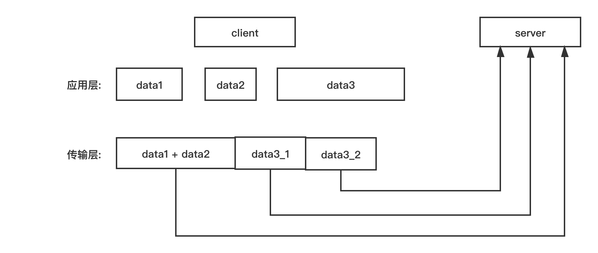

# Server启动过程以及命令解析

> 关于Server启动过程, 主要分为Server初始化、监听端口以及等待命令 3部分;

### 1. Server初始化

> 服务器初始化可简要分为7部分:
>
> 1. 初始化配置
> 2. 加载并解析配置文件
> 3. 初始化服务器内部变量, 包括数据库
> 4. 创建事件循环 eventLoop
> 5. 创建socket 并启动监听
> 6. 创建文件事件与时间事件
> 7. 开启事件循环

> 在 `server.c#main 函数` 中的整个过程： 
>
> ```c
> //server.c #main
> int main(int argc, char **argv) {
>     struct timeval tv;
>     int j;
>     //...
>     setlocale(LC_COLLATE,"");
>     tzset(); /* Populates 'timezone' global. */
>     zmalloc_set_oom_handler(redisOutOfMemoryHandler);
>     srand(time(NULL)^getpid());
>     gettimeofday(&tv,NULL);
> 
>     char hashseed[16];
>     getRandomHexChars(hashseed,sizeof(hashseed));
>     dictSetHashFunctionSeed((uint8_t*)hashseed);
>   
>     //检查程序是否以 sentinel 模式启动;
>     server.sentinel_mode = checkForSentinelMode(argc,argv); 
>   
>     initServerConfig(); //本函数会在下面说明
>   
>     moduleInitModulesSystem(); //初始化Module相关的数据结构
>   
>     //获取程序的绝对路径(主要调用了getcwd系统调用)以及执行参数等复制到server对应字段;
>     server.executable = getAbsolutePath(argv[0]); 
>     server.exec_argv = zmalloc(sizeof(char*)*(argc+1));
>     server.exec_argv[argc] = NULL;
>     for (j = 0; j < argc; j++) server.exec_argv[j] = zstrdup(argv[j]);
>  	
>     //对于以哨兵模式启动的程序来说, 执行if块中的逻辑; 
>     //关于它们的具体说明会记录到《哨兵模式.md》
>     if (server.sentinel_mode) { 
>         initSentinelConfig();
>         initSentinel();
>     } 
>   
>     //对于特定的程序来说, 直接执行相关逻辑
>     if (strstr(argv[0],"redis-check-rdb") != NULL) redis_check_rdb_main(argc,argv,NULL);
>     else if (strstr(argv[0],"redis-check-aof") != NULL) redis_check_aof_main(argc,argv);
>   
>     //处理命令行参数, 若其中指定了配置参数、配置文件等, 加载配置信息;
>     //也就是如果只执行"redis-server", 而不指定参数的话, 所以参数都按initServerConfig()中的初始值启动;
>     if (argc >= 2) {
>         j = 1; /* First option to parse in argv[] */
>         sds options = sdsempty();
>         char *configfile = NULL;
> 
>         /* Handle special options --help and --version  以及 --test-memory 命令行*/
>         if (strcmp(argv[1], "-v") == 0 ||
>             strcmp(argv[1], "--version") == 0) version();
>         if (strcmp(argv[1], "--help") == 0 ||
>             strcmp(argv[1], "-h") == 0) usage();
>         if (strcmp(argv[1], "--test-memory") == 0) {
>             if (argc == 3) {
>                 memtest(atoi(argv[2]),50);
>                 exit(0);
>             } else {
>                 fprintf(stderr,"Please specify the amount of memory to test in megabytes.\n");
>                 fprintf(stderr,"Example: ./redis-server --test-memory 4096\n\n");
>                 exit(1);
>             }
>         }
> 
>         //若命令的某个参数不是以 '-'号 开头, 则将之认为是配置文件;
>         //尝试获取配置文件的绝对路径并更新exec_argv中对应位置的参数;
>         if (argv[j][0] != '-' || argv[j][1] != '-') {
>             configfile = argv[j];
>             server.configfile = getAbsolutePath(configfile);
>             zfree(server.exec_argv[j]);
>             server.exec_argv[j] = zstrdup(server.configfile);
>             j++;
>         }
>         
>         //处理命令行中的配置参数: 比如"--port 6379"这样的参数, 经过下列逻辑的处理, 
>         //会得到 "port 6379\n" 这一行字符串, 并append到 options变量中;
>         //所以所有命令行参数最终会去除 "--"子串并得到对应的配置行之后附加到 options变量中; 
>         //而例外配置是 "--check-rdb"参数, 它会将"check-rdb\n"一行添加到options中;
>         while(j != argc) {
>             if (argv[j][0] == '-' && argv[j][1] == '-') {
>                 if (!strcmp(argv[j], "--check-rdb")) {
>                     j++;
>                     continue;
>                 }
>                 if (sdslen(options)) options = sdscat(options,"\n");
>                 options = sdscat(options,argv[j]+2);
>                 options = sdscat(options," ");
>             } else {
>                 /* Option argument */
>                 options = sdscatrepr(options,argv[j],strlen(argv[j]));
>                 options = sdscat(options," ");
>             }
>             j++;
>         }
>       
>         //检测configfile配置...略
>         resetServerSaveParams(); //清空rdb save配置字段
>       
>         //load配置文件
>         /*
>         按loadServerConfig逻辑, 会先读取configfile中的内容, 最后再append options中的命令参数内容;
>         即: 命令行参数会覆盖configfile 中的配置
>         */
>         loadServerConfig(configfile,options); 
>         sdsfree(options);
>     }
>   
>     //输出log, 第一行信息
>     serverLog(LL_WARNING, "oO0OoO0OoO0Oo Redis is starting oO0OoO0OoO0Oo");
>     //第二行log
>     serverLog(LL_WARNING,
>         "Redis version=%s, bits=%d, commit=%s, modified=%d, pid=%d, just started",
>         REDIS_VERSION, (sizeof(long) == 8) ? 64 : 32, redisGitSHA1(),
>         strtol(redisGitDirty(),NULL,10) > 0, (int)getpid());
> 
>     if (argc == 1) {
>         //若只以 "redis-server" 方式启动程序, 输出 warning 信息;
>         serverLog(LL_WARNING, "Warning: no config file specified, using the default config. In order to specify a config file use %s /path/to/%s.conf", argv[0], server.sentinel_mode ? "sentinel" : "redis");
>     } else {
>         serverLog(LL_WARNING, "Configuration loaded"); //若指定了配置信息, 则输出本行;
>     }
>   
>     server.supervised = redisIsSupervised(server.supervised_mode);
>     int background = server.daemonize && !server.supervised;
>     
>     //设置了 "daemonize"配置, 则将stdin/stdout/stderr重定向至 /dev/null中
>     if (background) daemonize();
> 
>     initServer(); //重要, 根据server初始值以及配置信息, 构建事件循环、创建aof文件以及分配或填充其它信息;
>   
>     //创建pidfile文件, pidfile路径默认为"/var/run/redis.pid" 或者是 配置"pidfile"中指定
>     if (background || server.pidfile) createPidFile();
>   
>     redisSetProcTitle(argv[0]); //保存server_mode/bindaddr/port信息至全局变量中
>   
>     redisAsciiArt();  //输出print 启动信息; 就是正常启动时的那个 大Logo 信息;
>   
>     checkTcpBacklogSettings(); //检测tcp backlog配置
> 
>     if (!server.sentinel_mode) {
>         serverLog(LL_WARNING,"Server initialized");
>     #ifdef __linux__
>         linuxMemoryWarnings();
>     #endif
>         moduleLoadFromQueue();  //加载Module, 暂略
>       
>         loadDataFromDisk(); //加载AOF和RDB数据;
>       
>         if (server.cluster_enabled) {
>             if (verifyClusterConfigWithData() == C_ERR) {
>                 serverLog(LL_WARNING,
>                     "You can't have keys in a DB different than DB 0 when in "
>                     "Cluster mode. Exiting.");
>                 exit(1);
>             }
>         }
>         if (server.ipfd_count > 0) //此字段已在initServer()函数中初始化完成; 输出最后一行信息;
>             serverLog(LL_NOTICE,"Ready to accept connections");
>         if (server.sofd > 0)
>             serverLog(LL_NOTICE,"The server is now ready to accept connections at %s", server.unixsocket);
>     } else {
>         sentinelIsRunning();
>     }
>   
>     /* Warning the user about suspicious maxmemory setting. */
>     if (server.maxmemory > 0 && server.maxmemory < 1024*1024) {
>         serverLog(LL_WARNING,"WARNING: You specified a maxmemory value that is less than 1MB (current value is %llu bytes). Are you sure this is what you really want?", server.maxmemory);
>     }
> 
>     //事件循环
>     aeSetBeforeSleepProc(server.el, beforeSleep);
>     aeSetAfterSleepProc(server.el, afterSleep);
>     aeMain(server.el);
>     aeDeleteEventLoop(server.el);
>     return 0;
> }
> ```
>
> 

#### 1.1 初始化配置 initServerConfig

> 由 initServerConfig 函数实现, 具体操作就是给配置参数赋初始值;

```c
//server.c
void initServerConfig(void) {
    int j;

    pthread_mutex_init(&server.next_client_id_mutex,NULL);
    pthread_mutex_init(&server.lruclock_mutex,NULL);
    pthread_mutex_init(&server.unixtime_mutex,NULL);
    updateCachedTime(); //设置 unixtime/mstime/daylight_active 字段为当前时间;
  
    //设置 runid/replid/replid2,分别为它们生成40字节长度的随机字符串, 其中字符为"0123456789abcdef"中的一个
    getRandomHexChars(server.runid,CONFIG_RUN_ID_SIZE);
    server.runid[CONFIG_RUN_ID_SIZE] = '\0';
    changeReplicationId();
    clearReplicationId2();
  
    server.timezone = timezone; /* Initialized by tzset(). */
    server.configfile = NULL;
    server.executable = NULL;
  
    server.config_hz = CONFIG_DEFAULT_HZ;  //serverCron函数执行频率, 调用次数/每秒, 默认为10;
    server.dynamic_hz = CONFIG_DEFAULT_DYNAMIC_HZ; //是否自适应调用频率, 默认为1;
    server.arch_bits = (sizeof(long) == 8) ? 64 : 32; //当前硬件为64位还是32位机器;
  
  
    server.port = CONFIG_DEFAULT_SERVER_PORT;  //监听端口, 默认6379
    server.maxclients = CONFIG_DEFAULT_MAX_CLIENTS; //最大客户端数目, 默认10000
    server.maxidletime = CONFIG_DEFAULT_CLIENT_TIMEOUT; //客户端超时时间, 默认0, 代表永不超时
    server.tcp_backlog = CONFIG_DEFAULT_TCP_BACKLOG; //511, Server socket等待队列长度;
    server.tcpkeepalive = CONFIG_DEFAULT_TCP_KEEPALIVE; //Tcp keepalive探测包发送timeout, 默认300
    server.bindaddr_count = 0;    //绑定的IP地址数量, 初始值为0
    server.unixsocket = NULL;     //本地UNIX socket
    //UNIX socket实际是通过文件读写进行通信, 设置该文件的权限, 默认为0
    server.unixsocketperm = CONFIG_DEFAULT_UNIX_SOCKET_PERM; 
    server.ipfd_count = 0; //已使用的网络 socket描述符数量
    server.sofd = -1;   //UNIX socket 文件描述符
  
  
    server.protected_mode = CONFIG_DEFAULT_PROTECTED_MODE; //是否不接受外部网络连接, 默认为1
    server.dbnum = CONFIG_DEFAULT_DBNUM; //数据库目录, 默认16
    server.verbosity = CONFIG_DEFAULT_VERBOSITY; //日志级别, 默认值为2, 表示LL_NOTICE
    
    //defrag相关, 略
    
    //客户端请求转换成的 Redis自定义协议字符串长度最大值, 默认为(512ll*1024*1024)
    server.proto_max_bulk_len = CONFIG_DEFAULT_PROTO_MAX_BULK_LEN;
  
    //用于缓存客户端请求的sds类型client#querybuf字段的最大容量, 默认(1024*1024*1024)
    server.client_max_querybuf_len = PROTO_MAX_QUERYBUF_LEN;
  
    server.saveparams = NULL; //RDB 存储点(save points)数组
    server.loading = 0; //是否正在从磁盘load数据, 应该指示是否正在执行RDB恢复过程
  
    server.logfile = zstrdup(CONFIG_DEFAULT_LOGFILE);//日志文件位置, 默认为空字符串""
    server.syslog_enabled = CONFIG_DEFAULT_SYSLOG_ENABLED; //是否启用syslog, 默认为0
    server.syslog_ident = zstrdup(CONFIG_DEFAULT_SYSLOG_IDENT);//syslog标识, 默认为 "redis"
    server.syslog_facility = LOG_LOCAL0; //
    
    //是否以守护进程启动,默认为0, 即false; 若是true, redis进程会将所有标准输入/输出/错误信息重定向到/dev/null
    server.daemonize = CONFIG_DEFAULT_DAEMONIZE; 
    server.supervised = 0;
    server.supervised_mode = SUPERVISED_NONE; //0
  
    server.aof_state = AOF_OFF; //是否启用aof, 默认关闭, 0
    //写aof文件时,调用fsync()的策略,默认为2, AOF_FSYNC_EVERYSEC
    server.aof_fsync = CONFIG_DEFAULT_AOF_FSYNC;
    
    //aof重写(rewrite)时不执行fsync, 默认为0;
    server.aof_no_fsync_on_rewrite = CONFIG_DEFAULT_AOF_NO_FSYNC_ON_REWRITE;
    //aof文件大小到达整个文件大小百分比时开始执行重写, 默认 100, 即文件写满之后才会aof重写
    server.aof_rewrite_perc = AOF_REWRITE_PERC;
  
    server.aof_rewrite_min_size = AOF_REWRITE_MIN_SIZE; //重写文件最小是(64*1024*1024)字节
    server.aof_rewrite_base_size = 0; /* 最近一次启动或重写的文件大小*/
    server.aof_rewrite_scheduled = 0; //BGSAVE命令执行完成之后是否立刻开始重写
    server.aof_last_fsync = time(NULL); //aof文件最后一次执行fsync()的时间
    server.aof_rewrite_time_last = -1;  //上次重写aof的持续时间
    server.aof_rewrite_time_start = -1; //本次aof 重写的开始时间;
    server.aof_lastbgrewrite_status = C_OK; //C_OK 或 C_ERR
    server.aof_delayed_fsync = 0;  /* delayed AOF fsync() counter */
    server.aof_fd = -1; //当前的aof文件描述符
    server.aof_selected_db = -1; //当前aof选定的DB /* Make sure the first time will not match */
    server.aof_flush_postponed_start = 0; //推迟的AOF flush时间
    server.aof_rewrite_incremental_fsync = CONFIG_DEFAULT_AOF_REWRITE_INCREMENTAL_FSYNC;
    server.rdb_save_incremental_fsync = CONFIG_DEFAULT_RDB_SAVE_INCREMENTAL_FSYNC;
    server.aof_load_truncated = CONFIG_DEFAULT_AOF_LOAD_TRUNCATED;
    server.aof_use_rdb_preamble = CONFIG_DEFAULT_AOF_USE_RDB_PREAMBLE;
  
  	server.pidfile = NULL; //server pid文件路径, 默认为NULL
    server.rdb_filename = zstrdup(CONFIG_DEFAULT_RDB_FILENAME); //rdb默认文件名 "dump.rdb"
    server.aof_filename = zstrdup(CONFIG_DEFAULT_AOF_FILENAME); //aof默认文件名 "appendonly.aof"
    server.requirepass = NULL; //如果持久化需要密码, 使用本字段, 默认为NULL;
    server.rdb_compression = CONFIG_DEFAULT_RDB_COMPRESSION;  //rdb文件是否压缩,默认为是,值为1;
    server.rdb_checksum = CONFIG_DEFAULT_RDB_CHECKSUM; //rdb文件是否需要校验和, 默认是, 值为1; 
    server.stop_writes_on_bgsave_err = CONFIG_DEFAULT_STOP_WRITES_ON_BGSAVE_ERROR; //默认1
    //...
  
    //...
    //是否 在aeEventLoop中注册的时间事件处理函数 serverCron() 中执行 字典增量式rehash 操作;
    server.activerehashing = CONFIG_DEFAULT_ACTIVE_REHASHING; 
  
    server.active_defrag_running = 0; //scan过程中的碎片整理
    server.notify_keyspace_events = 0; //在Pub/Sub 过程中传播的事件
  
    server.maxclients = CONFIG_DEFAULT_MAX_CLIENTS; //客户端数量限制, 默认10000
    server.blocked_clients = 0; //执行阻塞操作的客户端数量
    
    /*
    关于 server.blocked_clients_by_type, 它是一个unsigned int [BLOCKED_NUM] 数组, 数组长度为6;
    blocked_clients_by_type数组的作用是: 
      在server.c中将 阻塞类型分为如下5种类型:
    	#define BLOCKED_NONE 0    //Not blocked, no CLIENT_BLOCKED flag set
			#define BLOCKED_LIST 1    //BLPOP & co
			#define BLOCKED_WAIT 2    //WAIT for synchronous replication
			#define BLOCKED_MODULE 3  // Blocked by a loadable module 
			#define BLOCKED_STREAM 4  // XREAD
			#define BLOCKED_ZSET 5    // BZPOP et al
	
    而blocked_clients_by_type中保存的就是每种操作阻塞的客户端数量;
    */
    memset(server.blocked_clients_by_type,0, sizeof(server.blocked_clients_by_type));
  
    server.maxmemory = CONFIG_DEFAULT_MAXMEMORY; //内存限制, 默认为0, 即无限制
    server.maxmemory_policy = CONFIG_DEFAULT_MAXMEMORY_POLICY; //内存淘汰策略, 默认不淘汰
    server.maxmemory_samples = CONFIG_DEFAULT_MAXMEMORY_SAMPLES; //默认值5
    server.lfu_log_factor = CONFIG_DEFAULT_LFU_LOG_FACTOR;
    server.lfu_decay_time = CONFIG_DEFAULT_LFU_DECAY_TIME;
    server.hash_max_ziplist_entries = OBJ_HASH_MAX_ZIPLIST_ENTRIES;
    server.hash_max_ziplist_value = OBJ_HASH_MAX_ZIPLIST_VALUE;
    server.list_max_ziplist_size = OBJ_LIST_MAX_ZIPLIST_SIZE;
    server.list_compress_depth = OBJ_LIST_COMPRESS_DEPTH;
    server.set_max_intset_entries = OBJ_SET_MAX_INTSET_ENTRIES;
    server.zset_max_ziplist_entries = OBJ_ZSET_MAX_ZIPLIST_ENTRIES;
    server.zset_max_ziplist_value = OBJ_ZSET_MAX_ZIPLIST_VALUE;
    //...
  
    //... cluster 设置略
  
    //...
    server.next_client_id = 1; /* Client IDs, start from 1 .*/
    server.loading_process_events_interval_bytes = (1024*1024*2);
    server.lazyfree_lazy_eviction = CONFIG_DEFAULT_LAZYFREE_LAZY_EVICTION; //0
    server.lazyfree_lazy_expire = CONFIG_DEFAULT_LAZYFREE_LAZY_EXPIRE; //0
    server.lazyfree_lazy_server_del = CONFIG_DEFAULT_LAZYFREE_LAZY_SERVER_DEL; //0
    server.always_show_logo = CONFIG_DEFAULT_ALWAYS_SHOW_LOGO; //默认0;对于非标准输出, 是否也输出logo; 
  
    server.lua_time_limit = LUA_SCRIPT_TIME_LIMIT;//lua脚本timeout时间, 默认5000(ms)
    
    /*
    getLRUClock()函数作用: 当前系统时间值(单位秒)的二进制低24位
    */
    unsigned int lruclock = getLRUClock();
    atomicSet(server.lruclock,lruclock); //原子化设置server.lruclock值
  
    /*
    在 redisServer中包含 struct saveparam *saveparams; 和 int saveparamslen; 两个字段; 
       	struct saveparam {
    			time_t seconds; //标识秒数
    			int changes;    //标识改变次数
				};
				
		这里其实saveparams为 struct saveparam数组, 每次往数组中添加新元素时, 都根据 saveparamslen值重新分配
		空间; 之后在新分配的空间中设置对应的值;
    */
    resetServerSaveParams();  //saveparams 和 saveparamslen 字段复位为初始值
    //添加三条默认RDB持久化条件
  	appendServerSaveParams(60*60,1);  /* save after 1 hour and 1 change */
    appendServerSaveParams(300,100);  /* save after 5 minutes and 100 changes */
    appendServerSaveParams(60,10000); /* save after 1 minute and 10000 changes */
    
    //...
  
    //... 主从配置
    server.masterauth = NULL;
    server.masterhost = NULL;
    server.masterport = 6379;
    server.master = NULL;
    server.cached_master = NULL;
    server.master_initial_offset = -1;
    server.repl_state = REPL_STATE_NONE;
    server.repl_syncio_timeout = CONFIG_REPL_SYNCIO_TIMEOUT;
    server.repl_serve_stale_data = CONFIG_DEFAULT_SLAVE_SERVE_STALE_DATA;
    server.repl_slave_ro = CONFIG_DEFAULT_SLAVE_READ_ONLY;
    server.repl_slave_ignore_maxmemory = CONFIG_DEFAULT_SLAVE_IGNORE_MAXMEMORY;
    server.repl_slave_lazy_flush = CONFIG_DEFAULT_SLAVE_LAZY_FLUSH;
    server.repl_down_since = 0; /* Never connected, repl is down since EVER. */
    server.repl_disable_tcp_nodelay = CONFIG_DEFAULT_REPL_DISABLE_TCP_NODELAY;
    server.repl_diskless_sync = CONFIG_DEFAULT_REPL_DISKLESS_SYNC;
    server.repl_diskless_sync_delay = CONFIG_DEFAULT_REPL_DISKLESS_SYNC_DELAY;
    server.repl_ping_slave_period = CONFIG_DEFAULT_REPL_PING_SLAVE_PERIOD;
    server.repl_timeout = CONFIG_DEFAULT_REPL_TIMEOUT;
    server.repl_min_slaves_to_write = CONFIG_DEFAULT_MIN_SLAVES_TO_WRITE;
    server.repl_min_slaves_max_lag = CONFIG_DEFAULT_MIN_SLAVES_MAX_LAG;
    server.slave_priority = CONFIG_DEFAULT_SLAVE_PRIORITY;
    server.slave_announce_ip = CONFIG_DEFAULT_SLAVE_ANNOUNCE_IP;
    server.slave_announce_port = CONFIG_DEFAULT_SLAVE_ANNOUNCE_PORT;
    server.master_repl_offset = 0;
  
    server.repl_backlog = NULL;
    server.repl_backlog_size = CONFIG_DEFAULT_REPL_BACKLOG_SIZE;
    server.repl_backlog_histlen = 0;
    server.repl_backlog_idx = 0;
    server.repl_backlog_off = 0;
    server.repl_backlog_time_limit = CONFIG_DEFAULT_REPL_BACKLOG_TIME_LIMIT;
    server.repl_no_slaves_since = time(NULL);
  
    /* Client output buffer limits */
    for (j = 0; j < CLIENT_TYPE_OBUF_COUNT; j++)
        server.client_obuf_limits[j] = clientBufferLimitsDefaults[j];
  
    /* Double constants initialization */
    R_Zero = 0.0;
    R_PosInf = 1.0/R_Zero;
    R_NegInf = -1.0/R_Zero;
    R_Nan = R_Zero/R_Zero;
    //....
  
    //初始化命令表以及缓存常用命令到server的对应字段上
    server.commands = dictCreate(&commandTableDictType,NULL);
    server.orig_commands = dictCreate(&commandTableDictType,NULL);
    populateCommandTable();
    server.delCommand = lookupCommandByCString("del");
    server.multiCommand = lookupCommandByCString("multi");
    server.lpushCommand = lookupCommandByCString("lpush");
    server.lpopCommand = lookupCommandByCString("lpop");
    server.rpopCommand = lookupCommandByCString("rpop");
    server.zpopminCommand = lookupCommandByCString("zpopmin");
    server.zpopmaxCommand = lookupCommandByCString("zpopmax");
    server.sremCommand = lookupCommandByCString("srem");
    server.execCommand = lookupCommandByCString("exec");
    server.expireCommand = lookupCommandByCString("expire");
    server.pexpireCommand = lookupCommandByCString("pexpire");
    server.xclaimCommand = lookupCommandByCString("xclaim");
    server.xgroupCommand = lookupCommandByCString("xgroup");
    
    /* Slow log */
    server.slowlog_log_slower_than = CONFIG_DEFAULT_SLOWLOG_LOG_SLOWER_THAN; //10000
    //SLOWLOG max number of items logged 
    server.slowlog_max_len = CONFIG_DEFAULT_SLOWLOG_MAX_LEN;  //默认128
  
    /* Latency monitor */
    server.latency_monitor_threshold = CONFIG_DEFAULT_LATENCY_MONITOR_THRESHOLD; //0

    /* Debugging */
    server.assert_failed = "<no assertion failed>";
    server.assert_file = "<no file>";
    server.assert_line = 0;
    server.bug_report_start = 0;
    server.watchdog_period = 0;

    /* By default we want scripts to be always replicated by effects
     * (single commands executed by the script), and not by sending the
     * script to the slave / AOF. This is the new way starting from
     * Redis 5. However it is possible to revert it via redis.conf. */
    server.lua_always_replicate_commands = 1;
}
```


#### 1.2 加载并解析配置文件

> 入口函数: loadServerConfig； 作用是根据配置修改 server 中字段默认值修改为配置值；

```c
//config.c
//filename: 配置文件全路径名称; options: 自定义配置参数;
void loadServerConfig(char *filename, char *options) {
    sds config = sdsempty();
    char buf[CONFIG_MAX_LINE+1];

    /* Load the file content */
    if (filename) {
        FILE *fp;

        if (filename[0] == '-' && filename[1] == '\0') {
            fp = stdin;
        } else {
            if ((fp = fopen(filename,"r")) == NULL) {
                serverLog(LL_WARNING, "Fatal error, can't open config file '%s'", filename);
                exit(1);
            }
        }
        //按行读取所有行到config中
        while(fgets(buf,CONFIG_MAX_LINE+1,fp) != NULL)
            config = sdscat(config,buf);
        if (fp != stdin) fclose(fp);
    }
    /* Append the additional options */
    if (options) {
        config = sdscat(config,"\n");
        config = sdscat(config,options);
    }
    //到现在config中包含配置文件中的内容和自定义配置 options中的数据;
    //调用loadServerConfigFromString 按行解析内容;
    loadServerConfigFromString(config);
  
    sdsfree(config);
}

// loadServerConfigFromString 函数
// 所以实际的处理配置文件以及命令行参数的逻辑在 loadServerConfigFromString 函数中
void loadServerConfigFromString(char *config) {
    char *err = NULL;
    int linenum = 0, totlines, i;
    int slaveof_linenum = 0;
    sds *lines;
  
		//按'\n'符号split 字符串, 结果保存在lines数组中, totlines保存lines数组长度;
    lines = sdssplitlen(config,strlen(config), "\n", 1, &totlines);

    for (i = 0; i < totlines; i++) {
        sds *argv;
        int argc;

        linenum = i+1;
        lines[i] = sdstrim(lines[i]," \t\r\n");

        if (lines[i][0] == '#' || lines[i][0] == '\0') continue; //跳过空行以及'#'开头的注释行;

        argv = sdssplitargs(lines[i],&argc); //按空格分隔一行内容
        //检测argc和argv的逻辑, 略
        sdstolower(argv[0]); //将argv[0]转为小写
      
        //... 下面会根据argv[0] 以及 argc 设置对应的server字段, 具体的对应关系如下: 
        /*
        timeout => maxidletime
        tcp-keepalive => tcpkeepalive
        protected-mode => protected_mode (配置时会使用yes/no标识打开/关闭, 代码会相应的转为 1/0 值)
        port => port
        tcp-backlog => tcp_backlog
        bind => (bindaddr_count 为bind后的IP地址个数, bindaddr[]中保存每个IP字符串)
        unixsocket => unixsocket
        unixsocketperm => unixsocketperm
        save => saveparams数组中新增一个saveparam结构体
        dir => 不改变server中的字段, 但会调用chdir(argv[1]) 来切换当前进程的工作路径
        loglevel => verbosity
        logfile => logfile(也会通过 fopen(logfile, "a") 的返回结果判断此配置是否有效)
        always-show-logo => always_show_logo (yes/no转为1/0)
        syslog-enabled => syslog_enabled (yes/no)
        syslog-ident => syslog_ident
        syslog-facility => syslog_facility
        databases => dbnum
        include => 递归调用loadServerConfig处理被 include 的配置文件
        maxclients => maxclients
        maxmemory => maxmemory
        maxmemory-policy => maxmemory_policy
        maxmemory-samples => maxmemory_samples
        proto-max-bulk-len => proto_max_bulk_len
        client-query-buffer-limit => client_max_querybuf_len
        lfu-log-factor => lfu_log_factor
        lfu-decay-time => lfu_decay_time
        slaveof 或 replicaof => (masterhost masterport), 并更新repl_state = REPL_STATE_CONNECT
        repl-ping-slave-period 或 repl-ping-replica-period => repl_ping_slave_period
        repl-timeout => repl_timeout
        
        rename-command => 从server.commands中删除第一个参数的key, 并将原来的redisCommand添加到第二个参数
        									为key的entry中;
        									
        appendonly => aof_state (yes/no => AF_ON/Af_OFF)
        appendfilename => aof_filename
        maxclients => maxclients (打开文件描述符数量限制)
        ....太多了
        */
    }
}
```


#### 1.3 initServer

> 入口函数为 initServer； 
>
> 前面的  initServerConfig 初始化server字段默认值； loadServerConfig 按配置修改 server字段值；之后
>
> 调用 initServer 创建 server 中的网络Socket、创建事件循环、注册文件/时间事件Handler 等操作；

```c
//server.c
void initServer(void) {
  	int j;

    //注册信号处理函数; 
  	signal(SIGHUP, SIG_IGN);
    signal(SIGPIPE, SIG_IGN);
    setupSignalHandlers(); //参考《从server.c#initServer学习信号处理函数.md》
  
    if (server.syslog_enabled) {
        openlog(server.syslog_ident, LOG_PID | LOG_NDELAY | LOG_NOWAIT, server.syslog_facility);
    }
  
    server.hz = server.config_hz;
    server.pid = getpid(); //设置进程pid
    server.current_client = NULL;
    
    //初始化一堆双向链表
    server.clients = listCreate(); 
    server.clients_index = raxNew();
    server.clients_to_close = listCreate();
    server.slaves = listCreate();
    server.monitors = listCreate();
    server.clients_pending_write = listCreate();
    server.slaveseldb = -1; /* Force to emit the first SELECT command. */
    server.unblocked_clients = listCreate();
    server.ready_keys = listCreate();
    server.clients_waiting_acks = listCreate();
    server.get_ack_from_slaves = 0;
    server.clients_paused = 0;
    server.system_memory_size = zmalloc_get_memory_size();
  
  	/*
  	对象robj的refcout字段存储当前对象的引用次数, 意味着对象是可以共享的; 
  	但是需要注意的是, 只有当对象robj存储的 0～10000 的整数时, robj才会被共享, 且这些共享整数对象的引用计数
  		初始化为INT_MAX, 保证不会被释放;
  	此外, 执行命令时Redis会返回一些字符串回复, 这些字符串对象同样在服务器初始化时创建, 且永远不会尝试释放;
  	所有共享对象都存储在全局结构体变量 shared;
  	*/
  	createSharedObjects();

    /*
    在 initServerConfig()函数中, server.maxclients 默认初始值为10000; 
    此外, redis除与客户端连接的文件描述符之外, 
    	还设置了保留文件描述符数量"CONFIG_MIN_RESERVED_FDS=32"用于日志、rdb、aof等;
    所以这里尝试将本进程的文件描述符限制设置为 (10000 + 32);
    
    需要注意的是, 将fd数量限制改为10032时可能由于系统原因无法设置为这么大, 所以setrlimit调用可能会报错;
    如果报错的话, 会尝试将 maxclients 值降低16 后, 再重试, 直到设置成功;
    
    所以经过此函数处理之后, server.maxclients 字段值可能不是 10000, 而是比这个值小; 
    当然如果降低了 maxclients 字段值, 会输出日志进行提示;
    */
    adjustOpenFilesLimit();
  
    //重要的创建事件循环; 上面说了Redis设置了保留文件描述符数量 CONFIG_MIN_RESERVED_FDS = 32;
    //然而为了提供更安全的保障, 这里Redis又设置 "CONFIG_FDSET_INCR = CONFIG_MIN_RESERVED_FDS + 96";
    //所以 事件循环 监听描述符数量最大为 (maxclients + 128)
    server.el = aeCreateEventLoop(server.maxclients+CONFIG_FDSET_INCR);
  
    if (server.el == NULL) {
        serverLog(LL_WARNING, "Failed creating the event loop. Error message: '%s'",
            strerror(errno));
        exit(1);
    }
    //为server.db 分配空间
    server.db = zmalloc(sizeof(redisDb)*server.dbnum);
  
  	//创建serversocket/bind/listen, 在默认情况下会绑定IPv4 和 IPv6 两个版本的监听Serversocket;
    //ipfd字段存储 server socket fd; ipfd_count 存储绑定的IP数量;
  	if (server.port != 0 && listenToPort(server.port,server.ipfd,&server.ipfd_count) == C_ERR)
    	exit(1);
  
    // 创建UNIX socket; unixsocket字段指定文件路径; unixsocketperm字段设置文件权限;
    if (server.unixsocket != NULL) {
        unlink(server.unixsocket); /* don't care if this fails */
        server.sofd = anetUnixServer(server.neterr,server.unixsocket,
            server.unixsocketperm, server.tcp_backlog);
        if (server.sofd == ANET_ERR) {
            serverLog(LL_WARNING, "Opening Unix socket: %s", server.neterr);
            exit(1);
        }
        anetNonBlock(NULL,server.sofd);
    }
    
    //如果既没有TCP socket, 也没有UNIX socket; 则报错
    if (server.ipfd_count == 0 && server.sofd < 0) {
        serverLog(LL_WARNING, "Configured to not listen anywhere, exiting.");
        exit(1);
    }
  
    //初始化数据库
  	server.db = zmalloc(sizeof(redisDb)*server.dbnum);
  	for (j = 0; j < server.dbnum; j++) {
        server.db[j].dict = dictCreate(&dbDictType,NULL);
        server.db[j].expires = dictCreate(&keyptrDictType,NULL);
        server.db[j].blocking_keys = dictCreate(&keylistDictType,NULL);
        server.db[j].ready_keys = dictCreate(&objectKeyPointerValueDictType,NULL);
        server.db[j].watched_keys = dictCreate(&keylistDictType,NULL);
        server.db[j].id = j;
        server.db[j].avg_ttl = 0;
        server.db[j].defrag_later = listCreate();
  	}
    
    evictionPoolAlloc(); /* Initialize the LRU keys pool. ...略 */
    
    //pubsub_channels字段为 (channel => 订阅的 client 列表)
    server.pubsub_channels = dictCreate(&keylistDictType,NULL);
    server.pubsub_patterns = listCreate(); //订阅模式双向链表
    listSetFreeMethod(server.pubsub_patterns,freePubsubPattern);
    listSetMatchMethod(server.pubsub_patterns,listMatchPubsubPattern);
  
    server.cronloops = 0; //cron函数执行次数, 初始为0;
  
    server.rdb_child_pid = -1;
    server.aof_child_pid = -1;
    /* rdb数据输出目标, 是写到磁盘还是网络传输, 初始为0, 未指定;
    	#define RDB_CHILD_TYPE_NONE 0
			#define RDB_CHILD_TYPE_DISK 1     // RDB is written to disk
			#define RDB_CHILD_TYPE_SOCKET 2   // RDB is written to slave socket
    */
    server.rdb_child_type = RDB_CHILD_TYPE_NONE;
    server.rdb_bgsave_scheduled = 0;  //执行BGSAVE指令时更改为true;
    /*
    redisServer中定义了 "int child_info_pipe[2]" 字段; 作用应该是 当前进程 和 rdb/aof子进程 的通信管道;
    通信的数据类型是 child_info_data 字段类型;
    	struct {
        int process_type;           // AOF or RDB child?
        size_t cow_size;            // Copy on write size
        unsigned long long magic;   // Magic value to make sure data is valid
    	} child_info_data;
    */
    server.child_info_pipe[0] = -1;
    server.child_info_pipe[1] = -1;
    server.child_info_data.magic = 0;
    aofRewriteBufferReset(); //将aof_rewrite_buf_blocks字段初始化为空双向链表,listCreate();
    server.aof_buf = sdsempty(); //清空aof buf
    server.lastsave = time(NULL); /* At startup we consider the DB saved. */
    server.lastbgsave_try = 0;    /* At startup we never tried to BGSAVE. */
    server.rdb_save_time_last = -1;
    server.rdb_save_time_start = -1;
    server.dirty = 0; //上次save rdb之后是否更新过数据;
    resetServerStats(); //清零server中的状态字段;
    /* A few stats we don't want to reset: server startup time, and peak mem. */
    server.stat_starttime = time(NULL);
    server.stat_peak_memory = 0;
    server.stat_rdb_cow_bytes = 0;
    server.stat_aof_cow_bytes = 0;
    server.cron_malloc_stats.zmalloc_used = 0;
    server.cron_malloc_stats.process_rss = 0;
    server.cron_malloc_stats.allocator_allocated = 0;
    server.cron_malloc_stats.allocator_active = 0;
    server.cron_malloc_stats.allocator_resident = 0;
    server.lastbgsave_status = C_OK;
    server.aof_last_write_status = C_OK;
    server.aof_last_write_errno = 0;
    server.repl_good_slaves_count = 0;
  
  	//注册时间事件, 1毫秒之后执行 serverCron 函数;
  	if (aeCreateTimeEvent(server.el, 1, serverCron, NULL, NULL) == AE_ERR) {
    	serverPanic("Can't create event loop timers.");
    	exit(1);
  	}
  
  	//注册网络IO事件
  	for (j = 0; j < server.ipfd_count; j++) {
    	if (aeCreateFileEvent(server.el, server.ipfd[j], AE_READABLE,acceptTcpHandler,NULL) 
        	== AE_ERR) {
      	serverPanic("Unrecoverable error creating server.ipfd file event.");
    	}
  	}
    
    //注册 UNIX socket事件
    if (server.sofd > 0 && aeCreateFileEvent(server.el,server.sofd,AE_READABLE,
        acceptUnixHandler,NULL) == AE_ERR) {
    	serverPanic("Unrecoverable error creating server.sofd file event.");
    }
		
    //注册 module blocked client 管道事件
  	if (aeCreateFileEvent(server.el, server.module_blocked_pipe[0], AE_READABLE,
        moduleBlockedClientPipeReadable,NULL) == AE_ERR) {
            serverPanic("Error registering the readable event for the module "
                "blocked clients subsystem.");
    }
  
    //如果配置打开aof功能, 则打开 aof_filename 文件; 并在 aof_fd 中保存文件描述符;
    if (server.aof_state == AOF_ON) {
        server.aof_fd = open(server.aof_filename, O_WRONLY|O_APPEND|O_CREAT,0644);
        if (server.aof_fd == -1) {
            serverLog(LL_WARNING, "Can't open the append-only file: %s",strerror(errno));
            exit(1);
        }
    }
    //32位机器上设置内存限制
    if (server.arch_bits == 32 && server.maxmemory == 0) {
        serverLog(LL_WARNING,"Warning: 32 bit instance detected but no memory limit set." 
                  "Setting 3 GB maxmemory limit with 'noeviction' policy now.");
        server.maxmemory = 3072LL*(1024*1024); /* 3 GB */
        server.maxmemory_policy = MAXMEMORY_NO_EVICTION;
    }

    //.... 下面的函数未深入追究
  
    if (server.cluster_enabled) clusterInit(); //集群初始化
  
    replicationScriptCacheInit();
    scriptingInit(1);
    slowlogInit();
    latencyMonitorInit();
    bioInit();
    server.initial_memory_usage = zmalloc_used_memory();
}

//server.c
void createSharedObjects(void) {
    int j;

    shared.crlf = createObject(OBJ_STRING,sdsnew("\r\n"));
    shared.ok = createObject(OBJ_STRING,sdsnew("+OK\r\n"));
    shared.err = createObject(OBJ_STRING,sdsnew("-ERR\r\n"));
    shared.emptybulk = createObject(OBJ_STRING,sdsnew("$0\r\n\r\n"));
    shared.czero = createObject(OBJ_STRING,sdsnew(":0\r\n"));
    shared.cone = createObject(OBJ_STRING,sdsnew(":1\r\n"));
    shared.cnegone = createObject(OBJ_STRING,sdsnew(":-1\r\n"));
    shared.nullbulk = createObject(OBJ_STRING,sdsnew("$-1\r\n"));
    shared.nullmultibulk = createObject(OBJ_STRING,sdsnew("*-1\r\n"));
    shared.emptymultibulk = createObject(OBJ_STRING,sdsnew("*0\r\n"));
    shared.pong = createObject(OBJ_STRING,sdsnew("+PONG\r\n"));
    shared.queued = createObject(OBJ_STRING,sdsnew("+QUEUED\r\n"));
    shared.emptyscan = createObject(OBJ_STRING,sdsnew("*2\r\n$1\r\n0\r\n*0\r\n"));
    shared.wrongtypeerr = createObject(OBJ_STRING,sdsnew(
        "-WRONGTYPE Operation against a key holding the wrong kind of value\r\n"));
    shared.nokeyerr = createObject(OBJ_STRING,sdsnew(
        "-ERR no such key\r\n"));
    shared.syntaxerr = createObject(OBJ_STRING,sdsnew(
        "-ERR syntax error\r\n"));
    shared.sameobjecterr = createObject(OBJ_STRING,sdsnew(
        "-ERR source and destination objects are the same\r\n"));
    shared.outofrangeerr = createObject(OBJ_STRING,sdsnew(
        "-ERR index out of range\r\n"));
    shared.noscripterr = createObject(OBJ_STRING,sdsnew(
        "-NOSCRIPT No matching script. Please use EVAL.\r\n"));
    shared.loadingerr = createObject(OBJ_STRING,sdsnew(
        "-LOADING Redis is loading the dataset in memory\r\n"));
    shared.slowscripterr = createObject(OBJ_STRING,sdsnew(
        "-BUSY Redis is busy running a script. You can only call SCRIPT KILL or SHUTDOWN NOSAVE.\r\n"));
    shared.masterdownerr = createObject(OBJ_STRING,sdsnew(
        "-MASTERDOWN Link with MASTER is down and replica-serve-stale-data is set to 'no'.\r\n"));
    shared.bgsaveerr = createObject(OBJ_STRING,sdsnew(
        "-MISCONF Redis is configured to save RDB snapshots, but it is currently not able to persist on disk. Commands that may modify the data set are disabled, because this instance is configured to report errors during writes if RDB snapshotting fails (stop-writes-on-bgsave-error option). Please check the Redis logs for details about the RDB error.\r\n"));
    shared.roslaveerr = createObject(OBJ_STRING,sdsnew(
        "-READONLY You can't write against a read only replica.\r\n"));
    shared.noautherr = createObject(OBJ_STRING,sdsnew(
        "-NOAUTH Authentication required.\r\n"));
    shared.oomerr = createObject(OBJ_STRING,sdsnew(
        "-OOM command not allowed when used memory > 'maxmemory'.\r\n"));
    shared.execaborterr = createObject(OBJ_STRING,sdsnew(
        "-EXECABORT Transaction discarded because of previous errors.\r\n"));
    shared.noreplicaserr = createObject(OBJ_STRING,sdsnew(
        "-NOREPLICAS Not enough good replicas to write.\r\n"));
    shared.busykeyerr = createObject(OBJ_STRING,sdsnew(
        "-BUSYKEY Target key name already exists.\r\n"));
    shared.space = createObject(OBJ_STRING,sdsnew(" "));
    shared.colon = createObject(OBJ_STRING,sdsnew(":"));
    shared.plus = createObject(OBJ_STRING,sdsnew("+"));

    for (j = 0; j < PROTO_SHARED_SELECT_CMDS; j++) {
        char dictid_str[64];
        int dictid_len;

        dictid_len = ll2string(dictid_str,sizeof(dictid_str),j);
        shared.select[j] = createObject(OBJ_STRING,
            sdscatprintf(sdsempty(),
                "*2\r\n$6\r\nSELECT\r\n$%d\r\n%s\r\n",
                dictid_len, dictid_str));
    }
    shared.messagebulk = createStringObject("$7\r\nmessage\r\n",13);
    shared.pmessagebulk = createStringObject("$8\r\npmessage\r\n",14);
    shared.subscribebulk = createStringObject("$9\r\nsubscribe\r\n",15);
    shared.unsubscribebulk = createStringObject("$11\r\nunsubscribe\r\n",18);
    shared.psubscribebulk = createStringObject("$10\r\npsubscribe\r\n",17);
    shared.punsubscribebulk = createStringObject("$12\r\npunsubscribe\r\n",19);
    shared.del = createStringObject("DEL",3);
    shared.unlink = createStringObject("UNLINK",6);
    shared.rpop = createStringObject("RPOP",4);
    shared.lpop = createStringObject("LPOP",4);
    shared.lpush = createStringObject("LPUSH",5);
    shared.rpoplpush = createStringObject("RPOPLPUSH",9);
    shared.zpopmin = createStringObject("ZPOPMIN",7);
    shared.zpopmax = createStringObject("ZPOPMAX",7);
    for (j = 0; j < OBJ_SHARED_INTEGERS; j++) {
        shared.integers[j] = makeObjectShared(createObject(OBJ_STRING,(void*)(long)j));
        shared.integers[j]->encoding = OBJ_ENCODING_INT;
    }
    for (j = 0; j < OBJ_SHARED_BULKHDR_LEN; j++) {
        shared.mbulkhdr[j] = createObject(OBJ_STRING, sdscatprintf(sdsempty(),"*%d\r\n",j));
        shared.bulkhdr[j] = createObject(OBJ_STRING, sdscatprintf(sdsempty(),"$%d\r\n",j));
    }
    /* The following two shared objects, minstring and maxstrings, are not
     * actually used for their value but as a special object meaning
     * respectively the minimum possible string and the maximum possible
     * string in string comparisons for the ZRANGEBYLEX command. */
    shared.minstring = sdsnew("minstring");
    shared.maxstring = sdsnew("maxstring");
}
```


##### 1.3.1 关于绑定网络IP及其它网络设置

> **anet.c中定义了Redis关于网络API的应用, 可做为参考资料来深入学习Linux网络编程;**

```c
//server.c 关于 listenToPort函数 中的网络API调用可参考《从anet.c学习socket编程.md》
//创建server socket以及获取本机ip以及监听端口; 一般情况下, redis会找到2个通配符IP进行绑定监听, ipv4和ipv6; 
int listenToPort(int port, int *fds, int *count) {
    int j;

    /* Force binding of 0.0.0.0 if no bind address is specified, always
     * entering the loop if j == 0. */
    if (server.bindaddr_count == 0) server.bindaddr[0] = NULL;
    for (j = 0; j < server.bindaddr_count || j == 0; j++) {
        if (server.bindaddr[j] == NULL) {
            int unsupported = 0;
            //绑定IPv6 通配符监听
            fds[*count] = anetTcp6Server(server.neterr,port,NULL, server.tcp_backlog);
          
            if (fds[*count] != ANET_ERR) {
                anetNonBlock(NULL,fds[*count]);
                (*count)++;
            } else if (errno == EAFNOSUPPORT) {
                unsupported++;
                serverLog(LL_WARNING,"Not listening to IPv6: unsupproted");
            }

            if (*count == 1 || unsupported) {
                //绑定IPv4 通配符监听;
                fds[*count] = anetTcpServer(server.neterr,port,NULL,server.tcp_backlog);
                if (fds[*count] != ANET_ERR) {
                    anetNonBlock(NULL,fds[*count]);
                    (*count)++;
                } else if (errno == EAFNOSUPPORT) {
                    unsupported++;
                    serverLog(LL_WARNING,"Not listening to IPv4: unsupproted");
                }
            }
            /* Exit the loop if we were able to bind * on IPv4 and IPv6,
             * otherwise fds[*count] will be ANET_ERR and we'll print an
             * error and return to the caller with an error. */
            if (*count + unsupported == 2) break;
        } else if (strchr(server.bindaddr[j],':')) {
            /* Bind IPv6 address. */
            fds[*count] = anetTcp6Server(server.neterr,port,server.bindaddr[j],
                server.tcp_backlog);
        } else {
            /* Bind IPv4 address. */
            fds[*count] = anetTcpServer(server.neterr,port,server.bindaddr[j],
                server.tcp_backlog);
        }
        if (fds[*count] == ANET_ERR) {
            serverLog(LL_WARNING, "Creating Server TCP listening socket %s:%d: %s",
                server.bindaddr[j] ? server.bindaddr[j] : "*",
                port, server.neterr);
            return C_ERR;
        }
        anetNonBlock(NULL,fds[*count]);
        (*count)++;
    }
    return C_OK;
}
```


##### 1.3.2 处理用户连接函数 acceptTcpHandler

> **在 initServer函数中, 注册文件事件时, 通过eventLoop, 为server接收到客户端连接时调用acceptTcpHandler函数**
>
> > 需要注意的是下面代码中 createClient 函数给新客户端socket添加的 read handler：`readQueryFromClient`；
> >
> > `readQueryFromClient` 函数是下面**命令处理过程** 一节进行说明；

```c
//networking.c
void acceptTcpHandler(aeEventLoop *el, int fd, void *privdata, int mask) {
    int cport, cfd, max = MAX_ACCEPTS_PER_CALL;
    char cip[NET_IP_STR_LEN];
    UNUSED(el);
    UNUSED(mask);
    UNUSED(privdata);

    //max值为1000, 表示server socket每次唤醒epoll时, 最多接收1000个客户端连接;
    while(max--) {
        //调用accept接收用户端连接, cip会存储客户端ip地址, cport存储客户端端口, 而cfd为client socket描述符
        cfd = anetTcpAccept(server.neterr, fd, cip, sizeof(cip), &cport);
        if (cfd == ANET_ERR) {
            if (errno != EWOULDBLOCK)
                serverLog(LL_WARNING, "Accepting client connection: %s", server.neterr);
            return;
        }
        serverLog(LL_VERBOSE,"Accepted %s:%d", cip, cport);
      
        //处理客户端连接的逻辑
        acceptCommonHandler(cfd,0,cip);
    }
}
// networking.c
static void acceptCommonHandler(int fd, int flags, char *ip) {
    client *c;
    if ((c = createClient(fd)) == NULL) {  //主要看createClient函数
        serverLog(LL_WARNING, "Error registering fd event for the new client: %s (fd=%d)",
            strerror(errno),fd);
        close(fd); /* May be already closed, just ignore errors */
        return;
    }

    //如果当前已接受的客户端连接大于配置的server.maxclients字段限制; 默认10000;
    //直接调用 write API 给客户端socket 发送错误信息;
    if (listLength(server.clients) > server.maxclients) {
        char *err = "-ERR max number of clients reached\r\n";

        /* That's a best effort error message, don't check write errors */
        if (write(c->fd,err,strlen(err)) == -1) {
            /* Nothing to do, Just to avoid the warning... */
        }
        server.stat_rejected_conn++;
        freeClient(c);
        return;
    }
    
    //对于只监听 localhost 环回地址的网络socket, 则给客户端输出 protected mode 错误信息;
    if (server.protected_mode && server.bindaddr_count == 0 && server.requirepass == NULL 
        && !(flags & CLIENT_UNIX_SOCKET) && ip != NULL)
    {
        if (strcmp(ip,"127.0.0.1") && strcmp(ip,"::1")) {
            char *err =
                "-DENIED Redis is running in protected mode because protected "
                "mode is enabled, no bind address was specified, no "
                "authentication password is requested to clients. In this mode "
                "connections are only accepted from the loopback interface. "
                "If you want to connect from external computers to Redis you "
                "may adopt one of the following solutions: "
                "1) Just disable protected mode sending the command "
                "'CONFIG SET protected-mode no' from the loopback interface "
                "by connecting to Redis from the same host the server is "
                "running, however MAKE SURE Redis is not publicly accessible "
                "from internet if you do so. Use CONFIG REWRITE to make this "
                "change permanent. "
                "2) Alternatively you can just disable the protected mode by "
                "editing the Redis configuration file, and setting the protected "
                "mode option to 'no', and then restarting the server. "
                "3) If you started the server manually just for testing, restart "
                "it with the '--protected-mode no' option. "
                "4) Setup a bind address or an authentication password. "
                "NOTE: You only need to do one of the above things in order for "
                "the server to start accepting connections from the outside.\r\n";
            if (write(c->fd,err,strlen(err)) == -1) {
                /* Nothing to do, Just to avoid the warning... */
            }
            server.stat_rejected_conn++;
            freeClient(c);
          
            return;
        }
    }

    server.stat_numconnections++;
    c->flags |= flags;
}

//networking.c#createClient 创建client
client *createClient(int fd) {
    client *c = zmalloc(sizeof(client));
    if (fd != -1) {
        //设置socket fd选项
        anetNonBlock(NULL,fd); //设置客户端fd非阻塞
        anetEnableTcpNoDelay(NULL,fd);
        if (server.tcpkeepalive) //默认值300
            anetKeepAlive(NULL,fd,server.tcpkeepalive);
      
        //为客户端fd注册可读处理函数; readQueryFromClient会读取用户数据;
        if (aeCreateFileEvent(server.el,fd,AE_READABLE, readQueryFromClient, c) == AE_ERR)
        {
            close(fd);
            zfree(c);
            return NULL;
        }
    }
    
    //新客户端默认使用0数据库;
    //按照selectDb函数的实现, 它将 "c->db = &server.db[id]", 即客户端db实际都是server.db数组元素的指针
    selectDb(c,0);
  
    //设置client 字段默认值;
    uint64_t client_id;
    atomicGetIncr(server.next_client_id,client_id,1); //获取client_id, 中间加锁的原因是什么?
    c->id = client_id;
    c->fd = fd;
    c->name = NULL;
    c->bufpos = 0;
    c->qb_pos = 0;
    c->querybuf = sdsempty();
    c->pending_querybuf = sdsempty();
    c->querybuf_peak = 0;
    c->reqtype = 0;
    c->argc = 0;
    c->argv = NULL;
    c->cmd = c->lastcmd = NULL;
    c->multibulklen = 0;
    c->bulklen = -1;
    c->sentlen = 0;
    c->flags = 0;
    c->ctime = c->lastinteraction = server.unixtime;
    c->authenticated = 0;
    c->replstate = REPL_STATE_NONE;
    c->repl_put_online_on_ack = 0;
    c->reploff = 0;
    c->read_reploff = 0;
    c->repl_ack_off = 0;
    c->repl_ack_time = 0;
    c->slave_listening_port = 0;
    c->slave_ip[0] = '\0';
    c->slave_capa = SLAVE_CAPA_NONE;
    c->reply = listCreate();
    c->reply_bytes = 0;
    c->obuf_soft_limit_reached_time = 0;
    listSetFreeMethod(c->reply,freeClientReplyValue);
    listSetDupMethod(c->reply,dupClientReplyValue);
    c->btype = BLOCKED_NONE;
    c->bpop.timeout = 0;
    c->bpop.keys = dictCreate(&objectKeyHeapPointerValueDictType,NULL);
    c->bpop.target = NULL;
    c->bpop.xread_group = NULL;
    c->bpop.xread_consumer = NULL;
    c->bpop.xread_group_noack = 0;
    c->bpop.numreplicas = 0;
    c->bpop.reploffset = 0;
    c->woff = 0;
    c->watched_keys = listCreate();
    c->pubsub_channels = dictCreate(&objectKeyPointerValueDictType,NULL);
    c->pubsub_patterns = listCreate();
    c->peerid = NULL;
    c->client_list_node = NULL;
    listSetFreeMethod(c->pubsub_patterns,decrRefCountVoid);
    listSetMatchMethod(c->pubsub_patterns,listMatchObjects);
  
    /*
    linkClient函数: 将新client c 添加到 "server.clients" 双向链表尾部; 
    并且 c->client_list_node 也持有本client c 的指针, 这个字段的作用是当从server.clients中移除client时,
    	不需要遍历整个链表, 直接通过 client_list_node 字段即可; 
    */
    if (fd != -1) linkClient(c);
  
    initClientMultiState(c);
    return c;
}
```

#### 1.4 开启事件循环

> 在server.c 的main 函数体结尾; 

```c
//server.c
int main(void) {
  //...
  aeSetBeforeSleepProc(server.el,beforeSleep);
  aeSetAfterSleepProc(server.el,afterSleep);
  aeMain(server.el);
  aeDeleteEventLoop(server.el);
}

//ae.c
void aeMain(aeEventLoop *eventLoop) {
    eventLoop->stop = 0;
    while (!eventLoop->stop) {
        //在main.c中定义了beforeSleep和afterSleep函数;
        //而beforeSleep函数会执行一些不是很费时的操作, 如:集群相关,过期键删除, 向客户端返回命令回复等;
        if (eventLoop->beforesleep != NULL)
            eventLoop->beforesleep(eventLoop);
        aeProcessEvents(eventLoop, AE_ALL_EVENTS|AE_CALL_AFTER_SLEEP);
    }
}
```


#### 1.5 工具函数说明

##### 1.5.1 日志记录

```c
// server.h 中定义的日志级别
#define LL_DEBUG 0
#define LL_VERBOSE 1
#define LL_NOTICE 2
#define LL_WARNING 3
#define LL_RAW (1<<10) /* Modifier to log without timestamp */
#define CONFIG_DEFAULT_VERBOSITY LL_NOTICE //默认的日志级别为LL_NOTICE

//在 server.c#main 方法中记录日志应用, 以下一行输出的是redis启动时的第二行信息;
serverLog(LL_WARNING,
   "Redis version=%s, bits=%d, commit=%s, modified=%d, pid=%d, just started",
   REDIS_VERSION, (sizeof(long) == 8) ? 64 : 32, redisGitSHA1(),
   strtol(redisGitDirty(),NULL,10) > 0, (int)getpid());

//server.c#serverLog函数实现; level指示要输出信息的级别, fmt以及后面的变长参数用于格式化输出;
void serverLog(int level, const char *fmt, ...) {
    va_list ap;
    char msg[LOG_MAX_LEN];
    
    //server.verbosity字段存储的是指定的server日志级别; 如果level参数值小于server.verbosity, 直接跳过;
    if ((level&0xff) < server.verbosity) return; 

    va_start(ap, fmt);
    vsnprintf(msg, sizeof(msg), fmt, ap); //将格式化字符串写入msg字符数组中;
    va_end(ap);

    serverLogRaw(level,msg); //实际的输出函数;
}

//server.c#serverLogRaw 函数; 
/*
根据函数逻辑, level可以使用 "LL_WARNING" 来指定, 也可以使用 "LL_WARNING & LL_RAW" 来指定; 
如果带 LL_RAW 标志, 会直接输出 msg 参数; 
但如果不带 LL_RAW 标志, 则会先输出 pid/启动模式/时间 (具体参考下面的实现) 等信息之后, 再输出 msg 字符串; 
*/
void serverLogRaw(int level, const char *msg) {
    const int syslogLevelMap[] = { LOG_DEBUG, LOG_INFO, LOG_NOTICE, LOG_WARNING };
    const char *c = ".-*#";
    FILE *fp;
    char buf[64];
    int rawmode = (level & LL_RAW); 
    int log_to_stdout = server.logfile[0] == '\0';

    level &= 0xff; /* clear flags */
    if (level < server.verbosity) return;

    fp = log_to_stdout ? stdout : fopen(server.logfile,"a");
    if (!fp) return;

    if (rawmode) { //若level中指定了 LL_RAW标志, 则直接输出msg字符串
        fprintf(fp,"%s",msg);
    } else {
        int off;
        struct timeval tv;
        int role_char;
        pid_t pid = getpid();

        gettimeofday(&tv,NULL);
        struct tm tm;
        nolocks_localtime(&tm,tv.tv_sec,server.timezone,server.daylight_active);
        off = strftime(buf,sizeof(buf),"%d %b %Y %H:%M:%S.",&tm);
        snprintf(buf+off,sizeof(buf)-off,"%03d",(int)tv.tv_usec/1000);
        if (server.sentinel_mode) {
            role_char = 'X'; /* Sentinel. */
        } else if (pid != server.pid) {
            role_char = 'C'; /* RDB / AOF writing child. */
        } else {
            role_char = (server.masterhost ? 'S':'M'); /* Slave or Master. */
        }
        //c[level]用于根据level参数确定显示提示符信息, 即".-*#"中的其中一个;
        fprintf(fp,"%d:%c %s %c %s\n", (int)getpid(),role_char, buf,c[level],msg);
    }
    }
    fflush(fp);

    if (!log_to_stdout) fclose(fp);
    if (server.syslog_enabled) syslog(syslogLevelMap[level], "%s", msg);
}
```

# 命令处理过程

> **3.2节分析了在文件事件循环中, 对于用户端连接的处理过程; 之后Redis会注册readQueryFromClient函数处理客户端请求数据; 关于命令处理过程, 分为3个阶段: 解析命令请求、调用命令和返回结果;**

#### 1. 命令解析

> 由于TCP是基于字节流的传输层通信协议, 因此接收到的TCP数据不一定是一个完整的数据包, 其有可能是多个数据包的组合, 也有可能是某一个数据包的部分, 这种现象被称为**半包与粘包**; 如
>
> 如下图, 客户端应用层分别是发送3 个数据包, data3、data2和data1, 但是TCP传输层在真正发送数据时, 将data3数据包分割为data3_1与data3_2, 并且将data1与data2数据合并, 此时服务器接收到的包就不是一个完整的数据包;
>
> > 
>
> 为了区分一个完整的数据包, 通常有如下3种方法:
>
> 1. 数据包长度固定;
> 2. 通过特定的分隔符区分, 比如HTTP协议就是通过换行符区分的;
> 3. 通过数据包头部设置长度字段区分数据包长度, 比如FastCGI协议;
>
> **Redis采用自定义协议格式实现不同命令请求的区分; **
>
> > 如用户在redis-cli客户端键入如下命令:
> >
> > > **SET redis-key value1**
> >
> > 客户端会将该命令请求转换为如下协议格式, 然后发送给服务器:
> >
> > > **\*3\r\n$3\r\nSET\r\n$9\r\nredis-key\r\n$6\r\nvalue1\r\n**
> >
> > **其中， 换行符'\r\n'用于区分命令请求的若干参数， "*3"表示该命令请求有3个参数， "$3" "$9 "$6"等表示该参数字符串长度；**


> **Redis服务器接收到的命令请求首先存储在客户端对象的querybuf输入缓冲区, 然后解析命令请求各个参数, 并存储在客户端对象的argv(参数对象数组) 和 argc(参数数目)字段; 具体的处理逻辑, 也就是 readQueryFromClient 函数的逻辑;**
>
> ```c
> //networking.c#readQueryFromClient 解析客户端输入请求;
> void readQueryFromClient(aeEventLoop *el, int fd, void *privdata, int mask) {
> 	  //对于客户端socket, redis在为它注册handler时就将privdata设置为指向client的指针; 参考createClient;
> 		client *c = (client*) privdata; 
> 
> 		int nread, readlen;
> 		size_t qblen;
> 		UNUSED(el);
> 		UNUSED(mask);
> 
> 		readlen = PROTO_IOBUF_LEN; //16K, (1024*16)
> 	  /*	
> 		对于客户端对象: 
> 		reqtype 标识当前上次处理到客户端请求的哪一部分(即由于粘包/半包的原因, 上次只解析了请示的一部分):
> 			比如遇到'*'号时, 就将reqtype设置为PROTO_REQ_MULTIBULK (= 2);
> 			而遇到 '$'号时, 就将reqtype设置为PROTO_REQ_INLINE (=1);
> 			若client初始化 和 已处理完一条完整的命令请求时, 会将 reqtype 归零 (=0)
> 	
> 	  multibulklen 客户端请求参数个数, 即 '*'号 后的数字; 初始为0, 读到'*'号后处理后面的数字后赋值;
> 	  bulklen 当前请求参数字符串长度, 即 '$' 号后的数字; 初始值为-1, 读到'$'号后处理后面的数字后赋值;
> 		
> 		常量PROTO_MBULK_BIG_ARG:(1024*32) 32K;
> 		下面的if 判断的作用是, 如果当前正在处理客户端请求, 并且是读取其中的某个参数的过程中; 而'$'号后的数字
> 		值大于 32K(1024*32) 的话, 由于局部变量 readlen 初始化为16K, 假设 querybuf 当前保存的是前16K字节,
> 		则 ..., 我先补一下后面的代码逻辑再来补充这儿;
> 		*/
> 		if (c->reqtype == PROTO_REQ_MULTIBULK && c->multibulklen 
>      && c->bulklen != -1 && c->bulklen >= PROTO_MBULK_BIG_ARG) {
>       
> 				ssize_t remaining = (size_t)(c->bulklen+2)-sdslen(c->querybuf);
> 				
>    			if (remaining > 0 && remaining < readlen) readlen = remaining;
> 		}
> 
> 		/*
> 		  对于新客户端, querybuf中为空字符串, 则 qblen 值为0;
>       
> 		 	但对于接收过命令的client, 可能由于粘包或半包的原因, 
> 			c->querybuf 中保存着接收到的不完整的命令协议字符串; 或者 上次接收的命令之后还跟着下一命令的部分字符串;
> 	  	则此时 qblen 表示 "c->querybuf" 中的残余字符串长度; 
> 		*/
> 		qblen = sdslen(c->querybuf); 
> 
>  		//c->querybuf_peak 字段用于最近读取到querybuf中的最大长度;
> 		if (c->querybuf_peak < qblen) c->querybuf_peak = qblen;
> 
> 		c->querybuf = sdsMakeRoomFor(c->querybuf, readlen); //扩容querybuf
> 
> 	  /*读取client socket输入; 数据附加到querybuf缓冲区原有数据的后面(即不能覆盖querybuf原有数据) */ 
> 	  nread = read(fd, c->querybuf+qblen, readlen);
> 
> 		//根据nread返回值, 处理对应的错误信息 或者 客户端信息;
> 		if (nread == -1) {
> 				if (errno == EAGAIN) { //如果因为中断导致read返回-1, 直接return;
> 						return;
> 				} else {
>       			//read调用出错, 输出错误信息并关闭客户端信息
> 						serverLog(LL_VERBOSE, "Reading from client: %s",strerror(errno));
> 						freeClient(c);
> 						return;
> 				}
> 		} else if (nread == 0) { //收到客户端FIN报文; 显式关闭client;
> 				serverLog(LL_VERBOSE, "Client closed connection");
> 				freeClient(c);
> 				return;
> 		} else if (c->flags & CLIENT_MASTER) {
>   			//如果当前redis服务器为master, 将客户端请求附加到 c-> pending_querybuf 中进行暂存; 
> 				c->pending_querybuf = sdscatlen(c->pending_querybuf, c->querybuf+qblen,nread);
> 		}
> 
> 		//由于read函数将client socket输入写入到client->querybuf中, 是没有更新sds的len字段的;
> 		//所以这里更新sds len字段;
> 		sdsIncrLen(c->querybuf,nread); 
> 
> 		c->lastinteraction = server.unixtime; //server.unixtime字段每次都会在serverCron函数中更新;
> 
>     /* read_reploff字段: Read replication offset if this is a master */
> 		if (c->flags & CLIENT_MASTER) c->read_reploff += nread;//更新c->read_reploff字段;
> 
> 		server.stat_net_input_bytes += nread; //更新server.stat_net_input_bytes统计信息;
> 
> 		//server.client_max_querybuf_len 默认 1GB; 若从用户端读取的输入超过了限制, 报错;
> 		if (sdslen(c->querybuf) > server.client_max_querybuf_len) {
> 				sds ci = catClientInfoString(sdsempty(),c), bytes = sdsempty();
> 				bytes = sdscatrepr(bytes,c->querybuf,64);
> 				serverLog(LL_WARNING, 
>     			"Closing client that reached max query" 
>                   "buffer length: %s (qbuf initial bytes: %s)", 
>     			ci, bytes);
> 				sdsfree(ci);
> 				sdsfree(bytes);
> 				freeClient(c);
> 				return;
> 		}
> 		//这是解析客户端请求的主要逻辑
> 		processInputBufferAndReplicate(c);
> }
> 
> //networking.c#processInputBufferAndReplicate函数
> void processInputBufferAndReplicate(client *c) {
> 		//对于非集群master, 则单机模式服务器调用的是processInputBuffer函数;
> 		if (!(c->flags & CLIENT_MASTER)) {
> 				processInputBuffer(c);
> 		} else {
> 				size_t prev_offset = c->reploff;
> 				processInputBuffer(c);
> 				size_t applied = c->reploff - prev_offset;
> 				if (applied) {
> 						replicationFeedSlavesFromMasterStream(server.slaves,
>       		c->pending_querybuf, applied);
> 						sdsrange(c->pending_querybuf,applied,-1);
> 				}
> 		}
> }
> 
> //networking.c#processInputBuffer函数; 非主从(单机)模式下处理用户输入;
> void processInputBuffer(client *c) {
> 		server.current_client = c; //更新server.current_client字段, 表示正在读取本client信息;
> 
> 		while(c->qb_pos < sdslen(c->querybuf)) {  //c->qb_pos每次都从0开始
> 				/* Return if clients are paused. */
> 				if (!(c->flags & CLIENT_SLAVE) && clientsArePaused()) break;
> 
> 				/* Immediately abort if the client is in the middle of something. */
> 				if (c->flags & CLIENT_BLOCKED) break;
> 
> 		    if (server.lua_timedout && c->flags & CLIENT_MASTER) break; //略
> 
> 			  if (c->flags & (CLIENT_CLOSE_AFTER_REPLY|CLIENT_CLOSE_ASAP)) break; //略
>  
> 		    //如果 reqtype 字段未初始化过, 则根据 c->qb_post索引处的字符 进行对应的设置;
> 				if (!c->reqtype) {
> 					if (c->querybuf[c->qb_pos] == '*') {
>   						c->reqtype = PROTO_REQ_MULTIBULK;
> 					} else {
>   						c->reqtype = PROTO_REQ_INLINE;
> 					}
> 				}
>   
>      		//根据 reqtype 进行对应处理; processInlineBuffer 或 processMultibulkBuffer 函数;
> 				if (c->reqtype == PROTO_REQ_INLINE) {
> 					if (processInlineBuffer(c) != C_OK) break;
> 				} else if (c->reqtype == PROTO_REQ_MULTIBULK) {
> 					if (processMultibulkBuffer(c) != C_OK) break;
> 				} else {
> 					serverPanic("Unknown request type");
> 				}
> 
> 				/* 为啥会出现 argc == 0 的情况; Multibulk processing could see a <= 0 length */
> 				if (c->argc == 0) {
> 					resetClient(c);
> 				} else {
> 					/* Only reset the client when the command was executed. */
> 					if (processCommand(c) == C_OK) {
>   						if (c->flags & CLIENT_MASTER && !(c->flags & CLIENT_MULTI)) {
>     							/* Update the applied replication offset of our master. */
>     							c->reploff = c->read_reploff - sdslen(c->querybuf) + c->qb_pos;
>   						}
>          
>   						if (!(c->flags & CLIENT_BLOCKED) || c->btype != BLOCKED_MODULE)
>     							resetClient(c);
> 					}
> 			      
>    			if (server.current_client == NULL) break;
>  		}
> 	}
>   /* Trim to pos */
> 	if (c->qb_pos) {
>  		sdsrange(c->querybuf,c->qb_pos,-1); //去除 c->querybuf 中已被处理过的部分;
>  		c->qb_pos = 0;
> 	}
> 
> 	server.current_client = NULL; //函数开始时将current_client字段设置为当前client,现在清空;
> }
> 
> //networking.c # processMultibulkBuffer 函数;
> int processMultibulkBuffer(client *c) {
>  char *newline = NULL;
>  int ok;
>  long long ll;
> 
>  //每一次进入processMultibulkBuffer函数, multibulklen为0; 
>  //而if body就是为了从客户端输入中获取multibulklen值; 即"*3\r\n..."中'*'号后的数值;
>  if (c->multibulklen == 0) { 
>      /* The client should have been reset */
>      serverAssertWithInfo(c,NULL,c->argc == 0);
> 
>      //strchr api作用: 返回每一个指向字符串中对应字符的字符指针;
>      newline = strchr(c->querybuf+c->qb_pos,'\r');
>    
>      if (newline == NULL) { //如果c->querybuf中不包含'\r'字符, 直接报错
>          if (sdslen(c->querybuf)-c->qb_pos > PROTO_INLINE_MAX_SIZE) {
>              addReplyError(c,"Protocol error: too big mbulk count string");
>              setProtocolError("too big mbulk count string",c);
>          }
>          return C_ERR;
>      }
> 
>      /*
>      简单验证: 由于在Redis协议中, '\r\n'是相连的两个字符, newline的值为调用strchr找到'\r'索引值;
>      以"*3\r\n"为例, '\r'的索引值为2, 字符串长度为4;
>      所以正常情况下, "newline-(c->querybuf) = sdslen(c->querybuf) - 2";
>      下面if语句判断正常情况下应该为false;
>      
>      而具体如下if判断为true的情况是: querybuf中收到了'\r'字符, 但还没有收到'\n'字符;
>      所以等待收到后续的 '\n' 后再继续处理;
>      */
>      if (newline-(c->querybuf+c->qb_pos) > (ssize_t)(sdslen(c->querybuf)-c->qb_pos-2))
>          return C_ERR;
> 
>      serverAssertWithInfo(c,NULL,c->querybuf[c->qb_pos] == '*');
>    
>      //以"*3\r\n"为例, 这里调用string2ll函数获取中间的'3'数值, 数值赋值给 ll 局部变量;
>      ok = string2ll(c->querybuf+1+c->qb_pos,newline-(c->querybuf+1+c->qb_pos),&ll);
>    
>      if (!ok || ll > 1024*1024) { //检查数值转换结果;
>          addReplyError(c,"Protocol error: invalid multibulk length");
>          setProtocolError("invalid mbulk count",c);
>          return C_ERR;
>      }
> 
>      //更新c->qb_pos, 为它赋值第一个'$'字符索引;
>      c->qb_pos = (newline-c->querybuf)+2;
> 
>      if (ll <= 0) return C_OK;
>    
>      c->multibulklen = ll; //更新c->multibulklen 值
> 
>      //为 c->argv 分配空间, c->argv用于保存客户端命令参数;
>      if (c->argv) zfree(c->argv);
>      c->argv = zmalloc(sizeof(robj*)*c->multibulklen);
>  }
> 
>  while(c->multibulklen) {
>      //这里处理"*3\r\n$3\r\nSET\r\n$9\r\nredis-key\r\n$6\r\nvalue1\r\n"输入中的以$开头的处理
>      if (c->bulklen == -1) {
>          newline = strchr(c->querybuf+c->qb_pos,'\r');
>          //检查newline逻辑略过...
>          
>          //上面处理multibulklen值时, 已将qb_pos指向了'$'; 若不是, 报错;
>          if (c->querybuf[c->qb_pos] != '$') {
>              addReplyErrorFormat(c,"Protocol error: expected '$', got '%c'",
>                  c->querybuf[c->qb_pos]);
>              setProtocolError("expected $ but got something else",c);
>              return C_ERR;
>          }
>          
>          ok = string2ll(c->querybuf+c->qb_pos+1,newline-(c->querybuf+c->qb_pos+1),&ll);
>          //对ok和ll的检查略过...
>        
>          c->qb_pos = newline-c->querybuf+2; //同样更新c->qb_pos, 使它指向字符串;
>          if (ll >= PROTO_MBULK_BIG_ARG) {
>              /* If we are going to read a large object from network
>                  * try to make it likely that it will start at c->querybuf
>                  * boundary so that we can optimize object creation
>                  * avoiding a large copy of data.
>                  *
>                  * But only when the data we have not parsed is less than
>                  * or equal to ll+2. If the data length is greater than
>                  * ll+2, trimming querybuf is just a waste of time, because
>                  * at this time the querybuf contains not only our bulk. */
>                 if (sdslen(c->querybuf)-c->qb_pos <= (size_t)ll+2) {
>                     sdsrange(c->querybuf,c->qb_pos,-1);
>                     c->qb_pos = 0;
>                     /* Hint the sds library about the amount of bytes this string is
>                      * going to contain. */
>                     c->querybuf = sdsMakeRoomFor(c->querybuf,ll+2);
>                 }
>             }
>             c->bulklen = ll;
>         }
> 
>         /* Read bulk argument */
>         if (sdslen(c->querybuf)-c->qb_pos < (size_t)(c->bulklen+2)) {
>             /* Not enough data (+2 == trailing \r\n) */
>             break;
>         } else {
>             /* Optimization: if the buffer contains JUST our bulk element
>              * instead of creating a new object by *copying* the sds we
>              * just use the current sds string. */
>             if (c->qb_pos == 0 && c->bulklen >= PROTO_MBULK_BIG_ARG &&
>                 sdslen(c->querybuf) == (size_t)(c->bulklen+2))
>             {
>                 c->argv[c->argc++] = createObject(OBJ_STRING,c->querybuf);
>                 sdsIncrLen(c->querybuf,-2); /* remove CRLF */
>                 /* Assume that if we saw a fat argument we'll see another one
>                  * likely... */
>                 c->querybuf = sdsnewlen(SDS_NOINIT,c->bulklen+2);
>                 sdsclear(c->querybuf);
>             } else {
>                 c->argv[c->argc++] = createStringObject(c->querybuf+c->qb_pos,c->bulklen);
>                 c->qb_pos += c->bulklen+2;
>             }
>             c->bulklen = -1;
>             c->multibulklen--;
>         }
>     }
>   
>     /* We're done when c->multibulk == 0 */
>     if (c->multibulklen == 0) return C_OK;
> 
>     /* Still not ready to process the command */
>     return C_ERR;
> }
> ```
>


##### 1.1 createStringObject说明

> **可作为《1. 字符串sds.md》中关于raw和embeded字符串的参考;**

```c
//object.c
#define OBJ_ENCODING_EMBSTR_SIZE_LIMIT 44

robj *createStringObject(const char *ptr, size_t len) {
    if (len <= OBJ_ENCODING_EMBSTR_SIZE_LIMIT)
        return createEmbeddedStringObject(ptr,len);
    else
        return createRawStringObject(ptr,len);
}
robj *createEmbeddedStringObject(const char *ptr, size_t len) {
    robj *o = zmalloc(sizeof(robj)+sizeof(struct sdshdr8)+len+1);
    struct sdshdr8 *sh = (void*)(o+1);

    o->type = OBJ_STRING;
    o->encoding = OBJ_ENCODING_EMBSTR;
    o->ptr = sh+1;
    o->refcount = 1;
    if (server.maxmemory_policy & MAXMEMORY_FLAG_LFU) {
        o->lru = (LFUGetTimeInMinutes()<<8) | LFU_INIT_VAL;
    } else {
        o->lru = LRU_CLOCK();
    }

    sh->len = len;
    sh->alloc = len;
    sh->flags = SDS_TYPE_8;
    if (ptr == SDS_NOINIT)
        sh->buf[len] = '\0';
    else if (ptr) {
        memcpy(sh->buf,ptr,len);
        sh->buf[len] = '\0';
    } else {
        memset(sh->buf,0,len+1);
    }
    return o;
}


robj *createRawStringObject(const char *ptr, size_t len) {
    return createObject(OBJ_STRING, sdsnewlen(ptr,len));
}

robj *createObject(int type, void *ptr) {
    robj *o = zmalloc(sizeof(*o));
    o->type = type;
    o->encoding = OBJ_ENCODING_RAW;
    o->ptr = ptr;
    o->refcount = 1;

    /* Set the LRU to the current lruclock (minutes resolution), or
     * alternatively the LFU counter. */
    if (server.maxmemory_policy & MAXMEMORY_FLAG_LFU) {
        o->lru = (LFUGetTimeInMinutes()<<8) | LFU_INIT_VAL;
    } else {
        o->lru = LRU_CLOCK();
    }
    return o;
}
```


#### 2. 命令调用

> **在networking.c#processInputBuffer函数中, 若解析客户端命令成功, 则会调用processCommand处理该请求;**

```c
//server.c
int processCommand(client *c) {
    //1. 如果是'quit'命令, 则关闭客户端;
    if (!strcasecmp(c->argv[0]->ptr,"quit")) {
        addReply(c,shared.ok);
        c->flags |= CLIENT_CLOSE_AFTER_REPLY;
        return C_ERR;
    }

    //2. 执行lookupCommand查找命令, 若不存在则返回错误;
    //或者命令参数不合法, 返回错误;
    c->cmd = c->lastcmd = lookupCommand(c->argv[0]->ptr);
    if (!c->cmd) {
        flagTransaction(c);
        sds args = sdsempty();
        int i;
        for (i=1; i < c->argc && sdslen(args) < 128; i++)
            args = sdscatprintf(args, "`%.*s`, ", 128-(int)sdslen(args), (char*)c->argv[i]->ptr);
        addReplyErrorFormat(c,"unknown command `%s`, with args beginning with: %s",
            (char*)c->argv[0]->ptr, args);
        sdsfree(args);
        return C_OK;
    } else if ((c->cmd->arity > 0 && c->cmd->arity != c->argc) || (c->argc < -c->cmd->arity)) {
        flagTransaction(c);
        addReplyErrorFormat(c,"wrong number of arguments for '%s' command",
            c->cmd->name);
        return C_OK;
    }
  
    //3. 如果配置文件中设置了 "requirepass password"和密码, 若客户端未通过认证, 则只能执行"auth"命令;
    if (server.requirepass && !c->authenticated && c->cmd->proc != authCommand)
    {
        flagTransaction(c);
        addReply(c,shared.noautherr);
        return C_OK;
    }

    /* If cluster is enabled perform the cluster redirection here.
     * However we don't perform the redirection if:
     * 1) The sender of this command is our master.
     * 2) The command has no key arguments. */
    if (server.cluster_enabled &&
        !(c->flags & CLIENT_MASTER) &&
        !(c->flags & CLIENT_LUA &&
          server.lua_caller->flags & CLIENT_MASTER) &&
        !(c->cmd->getkeys_proc == NULL && c->cmd->firstkey == 0 &&
          c->cmd->proc != execCommand))
    {
        int hashslot;
        int error_code;
        clusterNode *n = getNodeByQuery(c,c->cmd,c->argv,c->argc,
                                        &hashslot,&error_code);
        if (n == NULL || n != server.cluster->myself) {
            if (c->cmd->proc == execCommand) {
                discardTransaction(c);
            } else {
                flagTransaction(c);
            }
            clusterRedirectClient(c,n,hashslot,error_code);
            return C_OK;
        }
    }
  
    /* Handle the maxmemory directive.
     *
     * First we try to free some memory if possible (if there are volatile
     * keys in the dataset). If there are not the only thing we can do
     * is returning an error.
     *
     * Note that we do not want to reclaim memory if we are here re-entering
     * the event loop since there is a busy Lua script running in timeout
     * condition, to avoid mixing the propagation of scripts with the propagation
     * of DELs due to eviction. */
    if (server.maxmemory && !server.lua_timedout) {
        int out_of_memory = freeMemoryIfNeeded() == C_ERR;
        /* freeMemoryIfNeeded may flush slave output buffers. This may result
         * into a slave, that may be the active client, to be freed. */
        if (server.current_client == NULL) return C_ERR;

        /* It was impossible to free enough memory, and the command the client
         * is trying to execute is denied during OOM conditions? Error. */
        if ((c->cmd->flags & CMD_DENYOOM) && out_of_memory) {
            flagTransaction(c);
            addReply(c, shared.oomerr);
            return C_OK;
        }
    }
  
    /* Don't accept write commands if there are problems persisting on disk
     * and if this is a master instance. */
    int deny_write_type = writeCommandsDeniedByDiskError();
    if (deny_write_type != DISK_ERROR_TYPE_NONE &&
        server.masterhost == NULL &&
        (c->cmd->flags & CMD_WRITE ||
         c->cmd->proc == pingCommand))
    {
        flagTransaction(c);
        if (deny_write_type == DISK_ERROR_TYPE_RDB)
            addReply(c, shared.bgsaveerr);
        else
            addReplySds(c,
                sdscatprintf(sdsempty(),
                "-MISCONF Errors writing to the AOF file: %s\r\n",
                strerror(server.aof_last_write_errno)));
        return C_OK;
    }
        
     /* Don't accept write commands if there are not enough good slaves and
     * user configured the min-slaves-to-write option. */
    if (server.masterhost == NULL &&
        server.repl_min_slaves_to_write &&
        server.repl_min_slaves_max_lag &&
        c->cmd->flags & CMD_WRITE &&
        server.repl_good_slaves_count < server.repl_min_slaves_to_write)
    {
        flagTransaction(c);
        addReply(c, shared.noreplicaserr);
        return C_OK;
    }

    /* Don't accept write commands if this is a read only slave. But
     * accept write commands if this is our master. */
    if (server.masterhost && server.repl_slave_ro &&
        !(c->flags & CLIENT_MASTER) &&
        c->cmd->flags & CMD_WRITE)
    {
        addReply(c, shared.roslaveerr);
        return C_OK;
    }

    /* Only allow SUBSCRIBE and UNSUBSCRIBE in the context of Pub/Sub */
    if (c->flags & CLIENT_PUBSUB &&
        c->cmd->proc != pingCommand &&
        c->cmd->proc != subscribeCommand &&
        c->cmd->proc != unsubscribeCommand &&
        c->cmd->proc != psubscribeCommand &&
        c->cmd->proc != punsubscribeCommand) {
        addReplyError(c,"only (P)SUBSCRIBE / (P)UNSUBSCRIBE / PING / QUIT allowed in this context");
        return C_OK;
    }
  
    /* Only allow commands with flag "t", such as INFO, SLAVEOF and so on,
     * when slave-serve-stale-data is no and we are a slave with a broken
     * link with master. */
    if (server.masterhost && server.repl_state != REPL_STATE_CONNECTED &&
        server.repl_serve_stale_data == 0 &&
        !(c->cmd->flags & CMD_STALE))
    {
        flagTransaction(c);
        addReply(c, shared.masterdownerr);
        return C_OK;
    }

    /* Loading DB? Return an error if the command has not the
     * CMD_LOADING flag. */
    if (server.loading && !(c->cmd->flags & CMD_LOADING)) {
        addReply(c, shared.loadingerr);
        return C_OK;
    }
  
    /* Lua script too slow? Only allow a limited number of commands. */
    if (server.lua_timedout &&
          c->cmd->proc != authCommand &&
          c->cmd->proc != replconfCommand &&
        !(c->cmd->proc == shutdownCommand &&
          c->argc == 2 &&
          tolower(((char*)c->argv[1]->ptr)[0]) == 'n') &&
        !(c->cmd->proc == scriptCommand &&
          c->argc == 2 &&
          tolower(((char*)c->argv[1]->ptr)[0]) == 'k'))
    {
        flagTransaction(c);
        addReply(c, shared.slowscripterr);
        return C_OK;
    }

    /* Exec the command */
    if (c->flags & CLIENT_MULTI &&
        c->cmd->proc != execCommand && c->cmd->proc != discardCommand &&
        c->cmd->proc != multiCommand && c->cmd->proc != watchCommand)
    {
        queueMultiCommand(c);
        addReply(c,shared.queued);
    } else {
        call(c,CMD_CALL_FULL); //3. 主要逻辑; 调用"c->cmd->proc(c)"
        c->woff = server.master_repl_offset;
        if (listLength(server.ready_keys))
            handleClientsBlockedOnKeys();
    }
    return C_OK;
}
```


#### 3. 调用命令

> 根据 client 中的命令行及参数，调用 server.commands 字典中注册的对应函数；
>
> 实际逻辑暂略；

#### 4. 输出响应

> 无论对 client 命令进行处理的结果是怎样，client 都会发送对应的 `成功或失败` 响应信息；
>
> 而输出信息都会调用类似于 **addReply** 格式函数进行处理，但这时的输出信息实际是写到了 client 结构体中的缓冲区；
>
> > **客户端结构体 client 中有两个关键字段 reply 和 buf ，分别表示输出链表与输出缓冲区；**

```c
//networking.c # addReply 函数
void addReply(client *c, robj *obj) {
    /*
    在prepareClientToWrite函数中有一个主要的调用:
    	if (!clientHasPendingReplies(c)) clientInstallWriteHandler(c);
    这一行的作用是, 将 当前client 添加到 server.clients_pending_write 双向链表头部;
    */
    if (prepareClientToWrite(c) != C_OK) return;

    if (sdsEncodedObject(obj)) {
        /*
        对于字符串类型输出, 先尝试将数据附加到 "c->buf" 缓冲区, 并更新对应的"c->bufpos"字段;
        但如果检测到 c->reply 双向链表中有待返回给客户端的数据, 则将数据添加到c->reply链表中;
        */
        if (_addReplyToBuffer(c,obj->ptr,sdslen(obj->ptr)) != C_OK)
            _addReplyStringToList(c,obj->ptr,sdslen(obj->ptr));
    } else if (obj->encoding == OBJ_ENCODING_INT) {
        //对int类型数据写出
        char buf[32];
        size_t len = ll2string(buf,sizeof(buf),(long)obj->ptr);
        if (_addReplyToBuffer(c,buf,len) != C_OK)
            _addReplyStringToList(c,buf,len);
    } else {
        serverPanic("Wrong obj->encoding in addReply()");
    }
}
```


##### 4.1 实际数据发送

> 上面的  `addReply` 函数逻辑只是将数据写到了client buf/reply 中，到底是什么时候调用client socket进行实际读写？？
>
> **实际的给客户端发送数据的写入是在 server.c#beforeSleep 函数；**

```c
//server.c#beforeSleep
void beforeSleep(struct aeEventLoop *eventLoop) {
  	//...
    /*
    按上面的 addReply 函数说明, 当client中有要输出的数据时, 会将client添加到clients_pending_write链表中;
    */
 		handleClientsWithPendingWrites(); //处理 server.clients_pending_write 链表中的client结构体
    //...
}

//networking.c
int handleClientsWithPendingWrites(void) {
    listIter li;
    listNode *ln;
    int processed = listLength(server.clients_pending_write);
    listRewind(server.clients_pending_write,&li);
    
    //遍历 server.clients_pending_write 
    while((ln = listNext(&li))) {
        client *c = listNodeValue(ln);
        c->flags &= ~CLIENT_PENDING_WRITE;
        listDelNode(server.clients_pending_write,ln);
			
        if (c->flags & CLIENT_PROTECTED) continue; //protected mode, 直接跳过;

        /*
        	1. 将client buf 和 reply 中的数据 写到 c->fd 中;
        */
        if (writeToClient(c->fd,c,0) == C_ERR) continue;

        /*
        	2. 由于 handleClientsWithPendingWrites 函数是在 redis事件循环中 beforeSleep 调用; 
        	所以本函数不能执行太长时间; 
          
          而在 writeToClient 函数中会判断写出的数据是否达到了每次 输出数据量 的最大限值(默认 64K), 
          如果达到了, 则不会继续输出数据;
          
          如下面的代码中, 如果"c->fd"要写出的数据量超过 64K, 则会为fd注册 sendReplyToClient 可写事件函数;
          会在该事件处理函数中发送剩余的数据给客户端;
        */
        if (clientHasPendingReplies(c)) {
            int ae_flags = AE_WRITABLE;
        
            if (server.aof_state == AOF_ON && server.aof_fsync == AOF_FSYNC_ALWAYS)
            {
                ae_flags |= AE_BARRIER;
            }
            if (aeCreateFileEvent(server.el, c->fd, ae_flags, sendReplyToClient, c) == AE_ERR)
            {
                    freeClientAsync(c);
            }
        }
    }
    return processed;
}  
```

